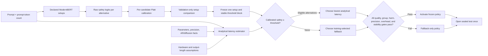

# Calibrated ModernBERT router for three Qwen capacity tiers

The recommended v3 proof of concept first collects a reproducible, cached quality
panel from three separated Qwen2.5 tiers—1.54B, 3.09B, and 7.61B parameters—then
trains
[`nomic-ai/modernbert-embed-base`](https://huggingface.co/nomic-ai/modernbert-embed-base)
with lightweight LoRA adapters to estimate whether a faster candidate can
preserve the quality of a strong fallback for each prompt. The notebook compares
loss and adapter-capacity setups, including a rank-8 capacity ablation,
before a deterministic analytical estimator selects the lowest-latency candidate
predicted safe.

ModernBERT does **not** predict latency and does **not** directly predict the
final model. Candidate latency comes from model size, generation architecture,
precision, prompt size, and explicit hardware assumptions. No candidate LLM is
timed to construct latency labels. In v3 the Qwen candidates are loaded one at a
time only during offline quality-evidence collection; their observed generation
time is neither recorded as a routing target nor used by the selector.

The project is an analytical-latency feasibility experiment, not a claim about
measured production latency.

The README is the current specification. Development history, earlier results,
and the reasons behind policy changes are kept in [`audits.md`](audits.md).

## Project in one minute

In plain language, the router asks: "Can the faster model answer this prompt
without doing worse than the trusted fallback?" If its calibrated confidence is
high enough and the analytical latency model predicts at least a 2% speedup, it
uses the fastest eligible alternative. Otherwise it safely uses the fallback.

Technically, ModernBERT predicts two separate fallback-relative safety
probabilities, one for each non-fallback Qwen tier. The selector combines those
probabilities with analytical latency estimates. The notebook compares three
training setups using validation outcomes only, freezes one setup and one stable
threshold region, and then opens the sealed test exactly once. The test is
successful only if
conservative quality, subgroup, harm, calibration, threshold-stability, and
latency-overhead gates all pass.

The v3 notebook freezes a six-run router plan: random and dataset-OOD modes at
seeds 42, 43, and 44. Its 900-prompt quality panel is collected once and cached
in Google Drive as 2,700 prompt-model outcomes, then reused across split seeds.
One Colab session executes one named router run and exports one ZIP. ModernBERT
batch-one overhead is measured on the active Colab GPU. Candidate generation is
not timed for routing, so candidate latency remains analytical. The router timing
is diagnostic and cannot retroactively change the frozen 4 ms and 20 ms gates.

For a simplified numerical example, suppose the fallback answers 80 of 100
prompts correctly. A routed policy answers 79 correctly, so its point-estimate
quality retention is $79/80=98.75\%$. That point estimate alone is insufficient:
the one-sided 95% lower confidence bound must also clear the predeclared 98%
test gate. If faster routing saves 50 ms per prompt before routing cost and the
router costs 4 ms, net analytical savings are $50-4=46$ ms per prompt. The
policy must satisfy both the quality and latency requirements.

The v3 setup comparison asks two concrete questions. Comparing rank-4 hybrid
training against rank-4 safety-only training tests whether the training-only
oracle helps. Comparing rank-4 against rank-8 hybrid training tests adapter
capacity. These are validation experiments; the test set is not used to pick the
winner. Notebook 02 retains the earlier dataset-balanced ablation.

## Current evidence: notebook 02 seed 44 did not pass

The latest completed run in
[`02_train_modernbert_hybrid_poc.ipynb`](notebooks/02_train_modernbert_hybrid_poc.ipynb)
used random seed 44 and the old Fin-R1/Qwen3-8B panel. It routed 623 of 2,805
sealed-test prompts (22.21%), gained 43 correct answers, lost 52, and ended nine
answers behind fallback. Its quality-retention point estimate was 99.55%, while
the one-sided 95% lower bound was 98.73%, above the 98% aggregate gate.

That aggregate result was not enough. Routed-safety precision was 91.65% with an
89.65% lower bound, below the 90% gate. The guarded worst-dataset retention lower
bound was 88.36%, below its 90% floor, and the macro-dataset quality lower bound
also failed. FinQA lost nine net answers and MMLU-Pro lost seven, while MBPP gained
17. Numerically, $43-52=-9$, so the run is a negative safety result even though
analytical latency savings remained positive.

ModernBERT end-to-end overhead was 42.55 ms at p50 and 67.23 ms at p95. The
frozen policy's break-even overhead was 52.14 ms, so median economics remained
positive but tail economics did not. At the frozen 4 ms and 20 ms assumptions,
analytical savings were 2.52% and 1.68%. This is why v3 tests more separated
candidate tiers: the old parameter ratio was $7.0/8.2=85.4\%$, leaving a narrow
latency margin, while the new small tier is $1.54/7.61=20.2\%$ of the strong
tier's parameter count.

## Routing logic



Only the calibrated safety head and analytical latency estimator are deployed.
The hindsight-oracle head is training-only.

## Deployment objective

Let $f$ be the strongest model on training data,
$\widehat P_m(\text{safe}\mid x)$ the calibrated ModernBERT safety estimate,
and $\widehat L_m(x)$ analytical latency. The selector solves:

$$
\pi(x)=\arg\min_m \widehat L_m(x)
$$

subject to:

$$
\widehat P_m(\text{safe}\mid x)\ge\tau,
\qquad
\widehat L_m(x)\le(1-\delta)\widehat L_f(x).
$$

The fallback is always eligible. The default minimum predicted speedup is
$\delta=0.02$. Validation chooses $\tau$ and activates the router only when:

$$
\operatorname{LCB}_{95\%}\left(
\frac{\mathbb E[Q_{\pi(x)}]}{\mathbb E[Q_f]}
\right)\ge0.98
$$

and net analytical latency savings remain positive after router overhead. The
notebook adds a validation-only margin $\gamma=0.01$, so activation requires:

$$
\operatorname{LCB}_{95\%,validation}\ge 0.98+\gamma=0.99.
$$

The sealed-test pass criterion is 0.98. The margin is not added to the test
after results are seen; it is a predeclared guard against validation optimism.

The current threshold-selection contract additionally requires:

$$
\begin{aligned}
\operatorname{LCB}_{95\%,macro} &\ge 0.98,\\
\operatorname{UCL}_{95\%}(P(\text{quality loss})) &\le 0.025,\\
\operatorname{LCB}_{95\%}(P(\text{safe}\mid\text{routed})) &\ge 0.90,\\
\min_{d:\,N_d\ge100}\operatorname{LCB}_{95\%,d} &\ge 0.90.
\end{aligned}
$$

Net analytical savings must also stay positive when router overhead is replaced
by the conservative 20 ms assumption. These are configurable command-line and
Python parameters, but their chosen values must be frozen before opening test.

Schema v5 also requires a contiguous block of at least two feasible threshold
grid values. Let $g_i=1$ when threshold $\tau_i$ passes every gate. Activation
requires a consecutive run with length at least two:

$$
\max_{a\le b}\left\{b-a+1:\prod_{i=a}^{b}g_i=1\right\}\ge2.
$$

For example, if only `0.910` passes, its feasible block size is one and the
router remains fallback-only. If `0.905` and `0.910` both pass, the block size
is two and the stability gate passes. This prevents a 0.005 threshold change
from silently moving the policy from safe to unsafe or from profitable to
unprofitable.

## Loss: what the router learns

### Plain-language intuition

The router is trained as a safety judge, not as an answer generator. For every
faster candidate, it learns whether choosing that candidate would preserve the
fallback's recorded quality. A separate training-only oracle teaches the shared
representation which safe choice would have been fastest, but that oracle is
never available when routing a new prompt.

For example, if the Qwen2.5-7B fallback scores 1 and Qwen2.5-1.5B scores 0, the
1.5B tier receives an unsafe label of 0. If both score 1, it receives a safe
label of 1. If both score 0, it also receives a safe label under the default
fallback-relative definition:
the replacement did not make the fallback's result worse, even though neither
model answered correctly. This distinction is why the loss estimates safe
replacement rather than absolute correctness.

### Technical definition

The router does **not** estimate absolute answer quality, latency, or the final
model choice. For each non-fallback candidate, it estimates the probability
that the candidate is a safe replacement for the strongest model selected on
the training split:

$$
\widehat P_m(\text{safe}\mid x)
=P\!\left(Q_m(x)\ge Q_f(x)-\epsilon_q
\mid\text{prompt text, prompt-token count}\right).
$$

Here, $Q_m(x)$ is candidate $m$'s recorded benchmark quality and $Q_f(x)$ is
the fallback's quality. The binary training target is:

$$
y_m(x)=\mathbf 1[Q_m(x)\ge Q_f(x)-\epsilon_q].
$$

Thus, $y_m=1$ means the candidate preserved fallback-relative quality, while
$y_m=0$ means that routing to it would lose more than the allowed tolerance.
The default is $\epsilon_q=0$, so the candidate must match or exceed the
fallback's recorded score. These are independent binary labels: with more than
one alternative, several candidates may be safe for the same prompt.

### Safety loss

The safety loss uses independent binary cross-entropy with a per-candidate
positive weight $N_{unsafe}/N_{safe}$, clipped to `[0.10, 10.0]`:

$$
\mathcal L_{safety}=\frac{1}{N(M-1)}
\sum_{x,m}\left[-w_my_m\log p_m-(1-y_m)\log(1-p_m)\right],
\qquad p_m=\sigma(s_m).
$$

For example, suppose Qwen2.5-1.5B is safe on 20 of 100 training prompts. Its positive
weight is:

$$
w_{1.5B}=\frac{80\text{ unsafe}}{20\text{ safe}}=4.
$$

If a safe prompt receives predicted probability $p=0.8$, its unweighted BCE is
$-\log(0.8)=0.223$. After class balancing, its contribution is
$4\times0.223=0.892$. This prevents the model from obtaining a deceptively low
loss by predicting "unsafe" for nearly every prompt when safe replacements are
rare.

### Training-only oracle loss

The hindsight oracle can see recorded outcomes and chooses the fastest model
that preserves fallback-relative quality:

$$
o(x)=\arg\min_m\widehat L_m(x)
\quad\text{subject to}\quad
Q_m(x)\ge Q_f(x)-\epsilon_q.
$$

Its auxiliary loss combines oracle imitation, expected quality risk, and
normalized latency regret:

$$
\mathcal L_{oracle}=(1+g_o)CE(z,o)
+4\sum_m p_m d_m+\sum_m p_m r_m.
$$

Here, $g_o=(L_f-L_o)/L_f$ is the non-negative latency opportunity available
from the oracle choice, $d_m=\max(Q_f-Q_m-\epsilon_q,0)$ is quality drop, and
$r_m=\max((L_m-L_o)/L_f,0)$ is normalized latency regret. The factor 4 makes
probability assigned to a quality-losing model more expensive than probability
assigned to a merely slower model.

For a numerical example, suppose Qwen2.5-1.5B and the Qwen2.5-7B fallback both
score 1 on a prompt, but their analytical latencies are 0.40 s and 1.00 s. The
1.5B tier is the oracle and the available speedup is
$g_o=(1.00-0.40)/1.00=0.60$. If the oracle head assigns probabilities
`[0.8, 0.2]` to `[Qwen2.5-1.5B, Qwen2.5-7B]`, then:

$$
\begin{aligned}
\text{oracle imitation} &=1.60[-\log(0.8)]=0.357,\\
\text{quality risk} &=0,\\
\text{latency regret} &=0.2\frac{1.00-0.40}{1.00}=0.120,\\
\mathcal L_{oracle} &=0.357+0+0.120=0.477.
\end{aligned}
$$

If the 1.5B tier instead scored 0 while the 7B tier scored 1, the 1.5B tier would
be unsafe and the oracle would choose 7B despite its higher latency. Assigning
probability to 1.5B would then incur the quality-risk penalty, illustrating that
preserving quality takes priority over saving latency.

### Complete training loss

The complete objective is:

$$
\boxed{\mathcal L_{train}=\mathcal L_{safety}
+0.25\mathcal L_{oracle}}.
$$

Continuing the safe-prompt example and assuming its candidate class weight is
$w_m=1$, the safety loss is $0.223$ and:

$$
\mathcal L_{train}=0.223+0.25(0.477)=0.34225\approx0.342.
$$

The safety head is the deployed prediction. The oracle head only shapes the
shared ModernBERT representation during training and is not consulted by the
production selector. The loss is therefore a differentiable training proxy for
the real objective: minimize latency subject to preserving fallback quality.

The Colab notebook treats the oracle coefficient and LoRA rank as predeclared
validation ablations:

| Setup | LoRA rank | Oracle coefficient | Question answered |
|---|---:|---:|---|
| `hybrid_r4` | 4 | 0.25 | Current hybrid baseline |
| `safety_only_r4` | 4 | 0.00 | Does the oracle auxiliary loss help? |
| `hybrid_r8` | 8 | 0.25 | Does additional adapter capacity help? |

All enabled setups use the same train/validation/test split. Their setup leaderboard,
calibration diagnostics, threshold frontiers, and training curves use validation
only. The selected setup alone is evaluated on sealed-test outcomes.

Notebook 02's historical dataset-balanced setup assigns every training row from dataset $d$ weight
$1/N_d$ and samples with replacement. After normalization, each of $D$ datasets
therefore supplies expected probability $1/D$ per optimizer draw. The BCE class
weights are calculated from the same dataset-balanced weights so sampling and
loss weighting describe one target distribution. For example, ordinary sampling
from datasets with 800 and 200 prompts draws them approximately 80% and 20% of
the time; dataset-balanced sampling targets 50% and 50%. The tradeoff is higher
variance and more repeated draws from the 200-prompt dataset, which is why it is
an ablation selected on validation rather than an unconditional replacement.

The LoRA adapter uses learning rate $10^{-4}$ while the randomly initialized
heads use $2\times10^{-4}$. Notebook training can run for at most eight epochs,
but stops
after two consecutive non-improving validation epochs once at least two epochs
have completed. The command-line default is five maximum epochs with the same
minimum-epoch and patience settings.

After checkpoint selection, each candidate receives a Platt scaler. Validation
rows use out-of-fold calibrated probabilities during threshold selection, so an
example never calibrates its own confidence. Final deployment parameters are
fitted on all validation rows and saved in the artifact.

## Analytical latency

For active parameters $P_m$, effective compute $F$, memory bandwidth $B$,
and precision $b$:

$$
t_{compute/token}=\frac{2P_m}{F},
\qquad
t_{memory/pass}=\frac{P_m b/8}{B}.
$$

Prefill depends on prompt length. Autoregressive decoding uses one sequential
weight pass per expected output token. Diffusion decoding uses declared
denoising passes per generated block. Expected output length depends only on
prompt size:

$$
\widehat n_{out}=\operatorname{clip}(a+cn,n_{min},n_{max}).
$$

Realized completion length is excluded. The notebook changes every recorded
completion length by 100× and asserts that analytical latency is unchanged.

### What is measured and what remains analytical

Candidate latency remains measurement-free throughout the POC. V3 loads the
three Qwen candidates sequentially to collect answer-quality outcomes, but it
does not treat collection runtime as candidate latency evidence. After validation
freezes the setup and threshold, the notebook measures only the ModernBERT
decision path on up to 100 deterministically sampled validation prompts after 10
warmup requests. It exports model-only and end-to-end batch-one distributions;
end-to-end includes tokenization, host-to-device transfer, and ModernBERT
inference.

For example, suppose a frozen policy's break-even router overhead is 26.9 ms.
A measured ModernBERT p50 of 14 ms is below break-even, while a p95 of 31 ms is
above it. The correct conclusion is that median economics remain viable but tail
latency needs batching, distillation, or a wider candidate latency gap. Neither
measurement changes the analytical candidate estimates or the already-opened
test result.

## Default v3 candidate panel

LLMRouterBench's public lightweight pool contains only roughly 7B–9B models, so
it cannot honestly answer the requested small/middle/strong comparison. V3
therefore collects a pinned 2,700-row quality panel from the closest official
Qwen2.5 instruction-tuned tiers:

| Candidate | Role | Official facts | V3 offline precision |
|---|---|---|---:|
| `Qwen2.5-1.5B` | small replacement | 1.54B, autoregressive | NF4 4-bit |
| `Qwen2.5-3B` | middle replacement | 3.09B, autoregressive | NF4 4-bit |
| `Qwen2.5-7B` | potential strong fallback | 7.61B, autoregressive | NF4 4-bit |

The pinned official model cards are
[`Qwen/Qwen2.5-1.5B-Instruct`](https://huggingface.co/Qwen/Qwen2.5-1.5B-Instruct),
[`Qwen/Qwen2.5-3B-Instruct`](https://huggingface.co/Qwen/Qwen2.5-3B-Instruct),
and
[`Qwen/Qwen2.5-7B-Instruct`](https://huggingface.co/Qwen/Qwen2.5-7B-Instruct).
The fallback is still selected from training quality rather than forced by size;
if 7B is not strongest on the training evidence, the notebook reports that
instead of assuming parameter count guarantees quality.

The v3 panel contains no diffusion model. Do not relabel an autoregressive
candidate as diffusion. Add a diffusion candidate only when comparable scored
quality outcomes and sourced inference settings are available.

## Two experiments, two different claims

### 1. Random-split feasibility

Five stratified group folds produce an approximate 60/20/20 train, validation,
and test split. The group key is SHA-256 of the NFKC-normalized prompt after
normalizing line endings and removing trailing whitespace. Case and leading
indentation remain significant because changing them can alter code semantics.

Thus, two source records with different IDs but the same normalized prompt must
remain in one split. For example, two MMLU rows with identical rendered question
and choices cannot enter train and test separately. This experiment asks whether
prompt content contains enough signal for safe replacement and remains the
default notebook mode.

### 2. Dataset-OOD stress test

Entire datasets are disjoint across train, validation, and test. This asks
whether the learned relationship generalizes to unseen domains. Run it as a
separate artifact only after random feasibility succeeds.

Repeat both modes with at least seeds 42, 43, and 44 before making a stability
claim. A random pass with an OOD failure proves feasibility, not cross-domain
generalization.

The immutable run IDs are:

| Run ID | Split claim | Seed |
|---|---|---:|
| `qwen25_random_seed_42` | prompt-level feasibility | 42 |
| `qwen25_random_seed_43` | prompt-level feasibility | 43 |
| `qwen25_random_seed_44` | prompt-level feasibility | 44 |
| `qwen25_dataset_ood_seed_42` | unseen-dataset stress test | 42 |
| `qwen25_dataset_ood_seed_43` | unseen-dataset stress test | 43 |
| `qwen25_dataset_ood_seed_44` | unseen-dataset stress test | 44 |

Only `RUN_ID` changes between Colab sessions. The loss, three setup ablations,
candidate facts, threshold grid, confidence gates, and analytical scenario remain
fixed, including the v3 scenario identity date `2026-08-21`. The candidate quality
evidence tag also freezes model and dataset revisions, prompt template, sampling,
quantization, and deterministic generation settings. See the
[`Colab runbook`](docs/COLAB_RUNBOOK.md).

## Train entirely in Google Colab

[Open notebook 03 in Google Colab](https://colab.research.google.com/github/BrunoVitti96/LLM-router/blob/develop/notebooks/03_train_modernbert_qwen_tiers_poc.ipynb)

1. Select **Runtime → Change runtime type → GPU**.
2. Leave `RUN_ID = "qwen25_random_seed_42"` for the first run and execute every
   cell from top to bottom. Authorize Google Drive so the 2,700 candidate
   outcomes survive a Colab disconnect.
3. The first execution collects three pinned Qwen outcome panels one model at a
   time. Later seeds reuse the evidence cache and train only the router.
4. Let all three router setups finish, then inspect the validation-only setup
   comparison, threshold frontier, and measured
   ModernBERT p50/p95 versus break-even overhead.
5. Use the Gradio share link to demonstrate safety probability, fallback use,
   analytical candidate latency, and estimated savings.
6. Download the generated `qwen25_random_seed_42` ZIP.
7. Repeat random seeds 43 and 44. Run the three `qwen25_dataset_ood_seed_*`
   artifacts separately only after random feasibility is understood.

The notebook downloads six pinned public evaluation datasets, samples 150 rows
from each, collects deterministic 4-bit outcomes from the three pinned Qwen2.5
checkpoints, proves completion-length leakage is absent, audits prompt-content
groups, runs validation-only sensitivity scenarios, trains and calibrates
ModernBERT with epoch-level logs and early stopping, and compares the declared
setups on validation. It freezes one setup with a validation safety margin and
threshold-stability rule, opens the sealed test once, and exports a
reconstructable artifact plus scored evidence. It then measures ModernBERT only
and launches a demo whose candidate latency remains analytical. The canonical v3
notebook is intentionally stored without execution output; the ZIP is the run
record.

The current investor-facing summary and honest limitations are in
[`docs/POC_INVESTOR_BRIEF.md`](docs/POC_INVESTOR_BRIEF.md). The gated use of
funding is described in
[`docs/FUNDED_VALIDATION_PLAN.md`](docs/FUNDED_VALIDATION_PLAN.md).

Each epoch log reports train and validation loss, whether it became the best
checkpoint, wall-clock seconds, training examples per second, cumulative skipped
mixed-precision steps, and whether early stopping will fire. For example, if an
epoch processes 540 pilot training examples in 30 seconds, the log reports
$540/30=18$ training examples per second.

The resolver may warn about Colab's unused Gradio installation. That warning is
not a router-training failure.

## Exported report

The report directory contains:

- `qwen_candidate_records.parquet`: all 2,700 scored, pinned candidate outcomes;
- `qwen_candidate_panel_summary.csv`: quality and analytical latency by tier;
- `qwen_evidence_contract.json`: evidence tag, model and dataset revisions,
  prompt template, sampling, quantization, and generation policy;
- `strategy_summary.csv`: baselines, oracle, router, and oracle-savings capture;
- `threshold_search.csv`: validation quality/savings frontier;
- `setup_comparison.csv`: validation-only setup leaderboard and the one row
  selected for sealed-test evaluation;
- `setup_threshold_search.csv`: all setup-specific threshold frontiers and
  per-gate pass/fail columns;
- `setup_diagnostics/<setup>/`: training and calibration diagnostics for every
  compared setup;
- `candidate_diagnostics.csv`: quality, safety, speed, and oracle-selection rate
  by split and candidate;
- `per_dataset_metrics.csv`: strategy quality, savings, harm bounds, and routing
  behavior for every sealed-test dataset;
- `validation_sensitivity.csv`: validation-only oracle headroom across analytical
  hardware and output-length assumptions;
- `test_router_overhead_sensitivity.csv`: the frozen test policy under several
  router-overhead assumptions;
- `modernbert_overhead_benchmark.json`: named-hardware ModernBERT-only timing
  contract and model-only/end-to-end distributions;
- `modernbert_overhead_samples.csv`: request-level router timing samples;
- `modernbert_overhead_comparison.csv`: 4 ms, 20 ms, measured p50/p95, and the
  frozen policy's break-even overhead;
- `test_decisions.parquet`: sealed-test prompt-level decisions;
- `experiment_manifest.json`: analytical assumptions, benchmark fingerprint,
  threshold-stability contract, and explicit single-run status;
- `modernbert_router/training_history.csv`;
- `modernbert_router/calibration_diagnostics.csv`;
- `modernbert_router/input_diagnostics.json`;
- exported Platt parameters, LoRA adapter, heads, tokenizer, and router manifest.

The schema-v5 `test_decisions.parquet` also stores
`safety_probability__<model>` for every candidate plus `router_input_tokens`
and `router_was_truncated`. Thus, if 17 routes are harmful, the report can show
whether they were high-confidence
errors or disproportionately truncated prompts. `strategy_summary.csv` and
`threshold_search.csv` add routed-precision LCB, safe-opportunity recall,
guarded-dataset retention, and conservative-overhead savings. Threshold reports
also include every individual gate, gate count, feasible block size, and final
stability status.

`single_run_passed` is true only when the frozen policy also passes every
sealed-test quality, savings, and non-trivial-routing criterion. Failure reasons
are written explicitly; a fallback-only result is not a successful router. The
legacy `poc_passed` key is a compatibility alias, not a multi-seed claim. The
exported artifact sets `deployment_enabled` only when both validation activation
and the sealed-test single-run gate pass. Its reproducibility block records the
repository commit, Python and package versions, GPU, and CUDA runtime.

## Historical LLMRouterBench command-line equivalents

The CLI commands below reproduce notebook 02's public-benchmark line of work.
Notebook 03 is the canonical three-tier Qwen workflow because its pinned quality
collection step is intentionally explicit in the notebook.

Feasibility:

```bash
llm-router-benchmark \
  --data-root /path/to/LLMRouterBench \
  --scenario configs/my_analytical_scenario.json \
  --models Fin-R1,Qwen3-8B \
  --objective latency \
  --split-mode random \
  --router modernbert-hybrid \
  --epochs 5 \
  --minimum-macro-quality-retention 0.98 \
  --maximum-quality-loss-rate-ucl 0.025 \
  --minimum-routed-safety-precision-lcb 0.90 \
  --minimum-guarded-dataset-quality-retention-lcb 0.90 \
  --minimum-guarded-dataset-prompts 100 \
  --conservative-router-overhead-ms 20 \
  --minimum-consecutive-feasible-thresholds 2 \
  --output-dir reports_benchmark/random_seed_42
```

Generalization stress test:

```bash
llm-router-benchmark \
  --data-root /path/to/LLMRouterBench \
  --scenario configs/my_analytical_scenario.json \
  --models Fin-R1,Qwen3-8B \
  --objective latency \
  --split-mode dataset_ood \
  --router modernbert-hybrid \
  --epochs 5 \
  --output-dir reports_benchmark/dataset_ood_seed_42
```

`--router tfidf` remains a cheap diagnostic baseline.
`--dataset-balanced-sampling` enables the equal-dataset sampling ablation for a
single CLI run; use a separate output directory and choose between runs using
validation evidence only.

## What counts as a credible POC

- validation-only oracle headroom remains positive across sensitivity scenarios;
- setup selection uses validation only and sealed-test outcomes are opened once;
- at least two neighboring thresholds pass every validation gate;
- every retained alternative has a non-zero oracle-selection rate;
- calibrated ModernBERT routes a non-trivial sealed-test fraction;
- the sealed-test 95% quality-retention LCB is at least 98%;
- the random split is disjoint by normalized prompt content, not only record ID;
- per-dataset retention and the harm-rate upper bound are reported;
- macro retention, routed-precision LCB, and the guarded worst-dataset floor
  pass their predeclared gates;
- net analytical savings remain positive after router overhead;
- net analytical savings also remain positive at the conservative overhead;
- random feasibility passes across several seeds; and
- dataset-OOD results are reported separately and honestly.

For commercial credibility, also require that measured ModernBERT p50 and p95
are compared with break-even overhead, and that customer-specific value is shown
without converting analytical milliseconds into guaranteed dollar savings.

Production still requires calibrating analytical constants with a small aggregate
hardware study. That is different from timing every candidate for every prompt.

## Repository layout

```text
README.md                                   # current project specification
audits.md                                   # historical runs and design changes

notebooks/
├── 01_train_modernbert_router.ipynb       # historical measured-latency run
├── 02_train_modernbert_hybrid_poc.ipynb   # executed historical 7B/8B run
└── 03_train_modernbert_qwen_tiers_poc.ipynb # recommended three-tier Colab POC

src/llm_router/
├── analytical_latency.py       # measurement-free latency equations
├── experiment_plan.py          # immutable six-run study and setup menu
├── router_overhead.py          # ModernBERT-only target-hardware timing
├── hybrid_inference.py         # analytical selector and Gradio demo runtime
├── oracle.py                   # balanced safety and auxiliary oracle losses
├── modernbert_poc.py           # training, calibration, and artifact export
├── experiment_comparison.py    # validation-only setup leaderboard
├── public_benchmark.py         # policy selection and sealed evaluation
├── benchmark_cli.py            # optional command-line driver
└── models/modernbert_router.py # ModernBERT + LoRA heads

docs/
├── COLAB_RUNBOOK.md            # one-run-per-ZIP execution order
├── POC_INVESTOR_BRIEF.md       # one-page evidence and limitations
└── FUNDED_VALIDATION_PLAN.md   # customers, milestones, and exit criteria
```

## Development checks

```bash
pytest
python -m compileall -q src
ruff check .
```
