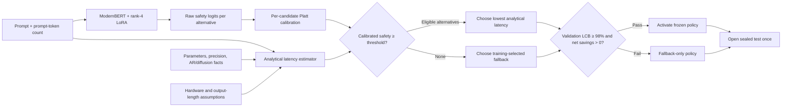

# Calibrated ModernBERT latency-aware LLM router

This proof of concept trains
[`nomic-ai/modernbert-embed-base`](https://huggingface.co/nomic-ai/modernbert-embed-base)
with rank-4 LoRA to estimate whether a faster candidate can preserve the quality
of a strong fallback for each prompt. A deterministic analytical estimator then
selects the lowest-latency candidate predicted safe.

ModernBERT does **not** predict latency and does **not** directly predict the
final model. Candidate latency comes from model size, generation architecture,
precision, prompt size, and explicit hardware assumptions. No candidate LLM is
loaded or timed to construct latency labels.

The project is an analytical-latency feasibility experiment, not a claim about
measured production latency.

## What changed after the first trained run

The first dataset-OOD run completed correctly but routed every sealed-test
prompt to Qwen3-8B. The outcome oracle showed about 4.9% analytical headroom,
so the pipeline and safety guard worked while the learned router did not.

That evidence led to five concrete changes:

1. random-split feasibility is now the first experiment; dataset-OOD is a
   separate generalization stress test;
2. safety BCE is class-balanced instead of learning the majority safe rate;
3. safety logits receive per-candidate Platt calibration, with out-of-fold
   probabilities used for validation threshold selection;
4. exact dataset identifiers were removed from ModernBERT inputs; and
5. the default panel removed a 9B candidate that was slower than the fallback
   and had a 0% oracle-selection rate.

The mixed-precision loop also avoids advancing the learning-rate scheduler when
`GradScaler` skips an optimizer step.

## Routing logic



Only the calibrated safety head and analytical latency estimator are deployed.
The hindsight-oracle head is training-only.

## Deployment objective

Let $f$ be the strongest model on training data,
$\widehat P_m(\text{safe}\mid x)$ the calibrated ModernBERT safety estimate,
and $\widehat L_m(x)$ analytical latency. The selector solves:

$$
\pi(x)=\arg\min_m \widehat L_m(x)
$$

subject to:

$$
\widehat P_m(\text{safe}\mid x)\ge\tau,
\qquad
\widehat L_m(x)\le(1-\delta)\widehat L_f(x).
$$

The fallback is always eligible. The default minimum predicted speedup is
$\delta=0.02$. Validation chooses $\tau$ and activates the router only when:

$$
\operatorname{LCB}_{95\%}\left(
\frac{\mathbb E[Q_{\pi(x)}]}{\mathbb E[Q_f]}
\right)\ge0.98
$$

and net analytical latency savings remain positive after router overhead.

## LOSS

The router does **not** estimate absolute answer quality, latency, or the final
model choice. For each non-fallback candidate, it estimates the probability
that the candidate is a safe replacement for the strongest model selected on
the training split:

$$
\widehat P_m(\text{safe}\mid x)
=P\!\left(Q_m(x)\ge Q_f(x)-\epsilon_q
\mid\text{prompt text, prompt-token count}\right).
$$

Here, $Q_m(x)$ is candidate $m$'s recorded benchmark quality and $Q_f(x)$ is
the fallback's quality. The binary training target is:

$$
y_m(x)=\mathbf 1[Q_m(x)\ge Q_f(x)-\epsilon_q].
$$

Thus, $y_m=1$ means the candidate preserved fallback-relative quality, while
$y_m=0$ means that routing to it would lose more than the allowed tolerance.
The default is $\epsilon_q=0$, so the candidate must match or exceed the
fallback's recorded score. These are independent binary labels: with more than
one alternative, several candidates may be safe for the same prompt.

### Safety loss

The safety loss uses independent binary cross-entropy with a per-candidate
positive weight $N_{unsafe}/N_{safe}$, clipped to `[0.10, 10.0]`:

$$
\mathcal L_{safety}=\frac{1}{N(M-1)}
\sum_{x,m}\left[-w_my_m\log p_m-(1-y_m)\log(1-p_m)\right],
\qquad p_m=\sigma(s_m).
$$

For example, suppose Fin-R1 is safe on 20 of 100 training prompts. Its positive
weight is:

$$
w_{Fin}=\frac{80\text{ unsafe}}{20\text{ safe}}=4.
$$

If a safe prompt receives predicted probability $p=0.8$, its unweighted BCE is
$-\log(0.8)=0.223$. After class balancing, its contribution is
$4\times0.223=0.892$. This prevents the model from obtaining a deceptively low
loss by predicting "unsafe" for nearly every prompt when safe replacements are
rare.

### Training-only oracle loss

The hindsight oracle can see recorded outcomes and chooses the fastest model
that preserves fallback-relative quality:

$$
o(x)=\arg\min_m\widehat L_m(x)
\quad\text{subject to}\quad
Q_m(x)\ge Q_f(x)-\epsilon_q.
$$

Its auxiliary loss combines oracle imitation, expected quality risk, and
normalized latency regret:

$$
\mathcal L_{oracle}=(1+g_o)CE(z,o)
+4\sum_m p_m d_m+\sum_m p_m r_m.
$$

Here, $g_o=(L_f-L_o)/L_f$ is the non-negative latency opportunity available
from the oracle choice, $d_m=\max(Q_f-Q_m-\epsilon_q,0)$ is quality drop, and
$r_m=\max((L_m-L_o)/L_f,0)$ is normalized latency regret. The factor 4 makes
probability assigned to a quality-losing model more expensive than probability
assigned to a merely slower model.

For a numerical example, suppose Fin-R1 and the Qwen fallback both score 1 on a
prompt, but their analytical latencies are 0.70 s and 1.00 s. Fin-R1 is the
oracle and the available speedup is $g_o=(1.00-0.70)/1.00=0.30$. If the oracle
head assigns probabilities `[0.8, 0.2]` to `[Fin-R1, Qwen]`, then:

$$
\begin{aligned}
\text{oracle imitation} &=1.30[-\log(0.8)]=0.290,\\
\text{quality risk} &=0,\\
\text{latency regret} &=0.2\frac{1.00-0.70}{1.00}=0.060,\\
\mathcal L_{oracle} &=0.290+0+0.060=0.350.
\end{aligned}
$$

If Fin-R1 instead scored 0 while Qwen scored 1, Fin-R1 would be unsafe and the
oracle would choose Qwen despite its higher latency. Assigning probability to
Fin-R1 would then incur the quality-risk penalty, illustrating that preserving
quality takes priority over saving latency.

### Complete training loss

The complete objective is:

$$
\boxed{\mathcal L_{train}=\mathcal L_{safety}
+0.25\mathcal L_{oracle}}.
$$

Continuing the safe-prompt example and assuming its candidate class weight is
$w_m=1$, the safety loss is $0.223$ and:

$$
\mathcal L_{train}=0.223+0.25(0.350)=0.3105\approx0.311.
$$

The safety head is the deployed prediction. The oracle head only shapes the
shared ModernBERT representation during training and is not consulted by the
production selector. The loss is therefore a differentiable training proxy for
the real objective: minimize latency subject to preserving fallback quality.

After checkpoint selection, each candidate receives a Platt scaler. Validation
rows use out-of-fold calibrated probabilities during threshold selection, so an
example never calibrates its own confidence. Final deployment parameters are
fitted on all validation rows and saved in the artifact.

## Analytical latency

For active parameters $P_m$, effective compute $F$, memory bandwidth $B$,
and precision $b$:

$$
t_{compute/token}=\frac{2P_m}{F},
\qquad
t_{memory/pass}=\frac{P_m b/8}{B}.
$$

Prefill depends on prompt length. Autoregressive decoding uses one sequential
weight pass per expected output token. Diffusion decoding uses declared
denoising passes per generated block. Expected output length depends only on
prompt size:

$$
\widehat n_{out}=\operatorname{clip}(a+cn,n_{min},n_{max}).
$$

Realized completion length is excluded. The notebook changes every recorded
completion length by 100× and asserts that analytical latency is unchanged.

## Default candidate panel

The clean default uses two benchmark candidates:

| Candidate | Role | Declared facts |
|---|---|---|
| `Fin-R1` | faster replacement | 7.0B, autoregressive, BF16 |
| `Qwen3-8B` | potential fallback | 8.2B, autoregressive, BF16 |

Qwen's official model card reports 8.2B parameters:
[`Qwen/Qwen3-8B`](https://huggingface.co/Qwen/Qwen3-8B).

The previous Nemotron candidate was removed from the default because it was
analytically slower than the Qwen fallback and therefore could never win the
latency oracle. NVIDIA also documents it as a Mamba-2/Transformer hybrid, which
needs a separate architecture sensitivity assumption rather than being treated
as an ordinary dense Transformer:
[`nvidia/NVIDIA-Nemotron-Nano-9B-v2`](https://huggingface.co/nvidia/NVIDIA-Nemotron-Nano-9B-v2).

The public benchmark pool contains no diffusion model. Do not relabel an
autoregressive candidate as diffusion. Add a diffusion candidate only when its
pre-collected quality results and sourced inference settings are available.

## Two experiments, two different claims

### 1. Random-split feasibility

Every dataset contributes prompt-disjoint train, validation, and test examples.
This asks whether prompt content contains enough signal for safe replacement.
It is the default notebook mode.

### 2. Dataset-OOD stress test

Entire datasets are disjoint across train, validation, and test. This asks
whether the learned relationship generalizes to unseen domains. Run it as a
separate artifact only after random feasibility succeeds.

Repeat both modes with at least seeds 42, 43, and 44 before making a stability
claim. A random pass with an OOD failure proves feasibility, not cross-domain
generalization.

## Train entirely in Google Colab

[Open notebook 02 in Google Colab](https://colab.research.google.com/github/BrunoVitti96/LLM-router/blob/develop/notebooks/02_train_modernbert_hybrid_poc.ipynb)

1. Select **Runtime → Change runtime type → GPU**.
2. Run every cell from top to bottom with `SPLIT_MODE = "random"`.
3. Download the generated random-split ZIP.
4. Repeat with additional seeds.
5. Only then change to `SPLIT_MODE = "dataset_ood"` and create separate ZIPs.

The notebook downloads LLMRouterBench, checks candidate names, proves
completion-length leakage is absent, runs validation-only sensitivity scenarios,
trains and calibrates ModernBERT, freezes the policy, opens the sealed test, and
exports a reconstructable artifact plus report.

The resolver may warn about Colab's unused Gradio installation. That warning is
not a router-training failure.

## Exported report

The report directory contains:

- `strategy_summary.csv`: baselines, oracle, router, and oracle-savings capture;
- `threshold_search.csv`: validation quality/savings frontier;
- `candidate_diagnostics.csv`: quality, safety, speed, and oracle-selection rate
  by split and candidate;
- `validation_sensitivity.csv`: validation-only oracle headroom across analytical
  hardware and output-length assumptions;
- `test_decisions.parquet`: sealed-test prompt-level decisions;
- `experiment_manifest.json`: analytical assumptions and explicit POC status;
- `modernbert_router/training_history.csv`;
- `modernbert_router/calibration_diagnostics.csv`;
- exported Platt parameters, LoRA adapter, heads, tokenizer, and router manifest.

`poc_passed` is true only when the frozen policy also passes every sealed-test
quality, savings, and non-trivial-routing criterion. Failure reasons are written
explicitly; a fallback-only result is not a successful router. The exported
artifact sets `deployment_enabled` only when both validation activation and the
sealed-test POC gate pass.

## Command-line equivalents

Feasibility:

```bash
llm-router-benchmark \
  --data-root /path/to/LLMRouterBench \
  --scenario configs/my_analytical_scenario.json \
  --models Fin-R1,Qwen3-8B \
  --objective latency \
  --split-mode random \
  --router modernbert-hybrid \
  --epochs 5 \
  --output-dir reports_benchmark/random_seed_42
```

Generalization stress test:

```bash
llm-router-benchmark \
  --data-root /path/to/LLMRouterBench \
  --scenario configs/my_analytical_scenario.json \
  --models Fin-R1,Qwen3-8B \
  --objective latency \
  --split-mode dataset_ood \
  --router modernbert-hybrid \
  --epochs 5 \
  --output-dir reports_benchmark/dataset_ood_seed_42
```

`--router tfidf` remains a cheap diagnostic baseline.

## What counts as a credible POC

- validation-only oracle headroom remains positive across sensitivity scenarios;
- every retained alternative has a non-zero oracle-selection rate;
- calibrated ModernBERT routes a non-trivial sealed-test fraction;
- the sealed-test 95% quality-retention LCB is at least 98%;
- net analytical savings remain positive after router overhead;
- random feasibility passes across several seeds; and
- dataset-OOD results are reported separately and honestly.

Production still requires calibrating analytical constants with a small aggregate
hardware study. That is different from timing every candidate for every prompt.

## Repository layout

```text
notebooks/
├── 01_train_modernbert_router.ipynb       # historical measured-latency run
└── 02_train_modernbert_hybrid_poc.ipynb   # recommended calibrated Colab POC

src/llm_router/
├── analytical_latency.py       # measurement-free latency equations
├── oracle.py                   # balanced safety and auxiliary oracle losses
├── modernbert_poc.py           # training, calibration, and artifact export
├── public_benchmark.py         # policy selection and sealed evaluation
├── benchmark_cli.py            # optional command-line driver
└── models/modernbert_router.py # ModernBERT + LoRA heads
```

## Development checks

```bash
pytest
python -m compileall -q src
ruff check .
```
