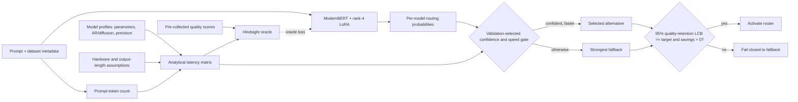

# ModernBERT latency-aware LLM router POC

This repository trains
[`nomic-ai/modernbert-embed-base`](https://huggingface.co/nomic-ai/modernbert-embed-base)
with rank-4 LoRA to choose the lowest-latency LLM that preserves the quality of
the strongest candidate. Candidate quality comes from a pre-collected public
benchmark; candidate latency is **not measured by running every model on every
prompt**. It is calculated from model size, architecture, precision, hardware
assumptions, and prompt size.

This is a proof of concept and a sensitivity-analysis tool. Analytical latency
is a consistent routing proxy, not a production latency benchmark.

## What the router does



The only model executed at routing time is the small ModernBERT router. The
candidate LLM is executed only after it is selected. Offline candidate outputs
are still required to supervise and evaluate quality; LLMRouterBench supplies
those without requiring this POC to regenerate them.

## Analytical latency model

For active parameter count \(P_m\), prompt tokens \(n\), effective compute \(F\),
memory bandwidth \(B\), and weight precision \(b\):

$$
t_{compute/token}=\frac{2P_m}{F}, \qquad
t_{memory/pass}=\frac{P_m b/8}{B}.
$$

Prefill is approximated as \(n\,t_{compute/token}\). Autoregressive decoding
performs one sequential pass per expected output token. A diffusion model
performs `diffusion_steps` passes per output block. The expected output length is
a bounded function of prompt tokens, fixed before looking at any candidate
response:

$$
\widehat n_{out}=\operatorname{clip}(a+c n,n_{min},n_{max}).
$$

Therefore, changing a benchmark row's realized completion length does not
change its analytical latency. All assumptions are exported with the report so
they can be varied in sensitivity runs. The implementation is in
`src/llm_router/analytical_latency.py`.

## Oracle target and oracle loss

Let \(f\) be the strongest model on the training split, \(Q_m(x)\) the observed
quality, and \(\widehat L_m(x)\) analytical latency. The hindsight oracle is:

$$
o(x)=\arg\min_m \widehat L_m(x)
\quad\text{subject to}\quad
Q_m(x)\ge Q_f(x)-\epsilon_q.
$$

The fallback is always eligible. ModernBERT emits one logit \(z_m(x)\) per
candidate. Its loss has three parts:

$$
\mathcal L_{oracle}=
\underbrace{(1+g_o)\,CE(z,o)}_{\text{imitate the best safe route}}
+4\underbrace{\sum_m p_m d_m}_{\text{expected quality risk}}
+\underbrace{\sum_m p_m r_m}_{\text{expected latency regret}},
$$

where \(p=\operatorname{softmax}(z)\),

$$
g_o=\max\left(0,\frac{\widehat L_f-\widehat L_o}{\widehat L_f}\right),
\quad
d_m=\max(0,Q_f-Q_m-\epsilon_q),
\quad
r_m=\max\left(0,\frac{\widehat L_m-\widehat L_o}{\widehat L_f}\right).
$$

In plain language:

- cross-entropy teaches the exact hindsight choice and emphasizes prompts with
  a large safe speed opportunity;
- expected quality risk heavily penalizes probability placed on a model that
  loses to the fallback;
- latency regret penalizes probability placed on a safe but unnecessarily slow
  model.

This loss does not by itself make a deployment claim. Validation selects the
confidence threshold, requires predicted latency savings, and activates the
router only when the one-sided quality-retention lower confidence bound meets
the configured target and net latency savings remain positive. The loss is in
`src/llm_router/oracle.py`.

## Run the POC

Install the project:

```bash
pip install -e ".[dev]"
```

Download and extract
[LLMRouterBench](https://github.com/ynulihao/LLMRouterBench), then inspect its
dataset/model directory names:

```bash
llm-router-benchmark --data-root /path/to/LLMRouterBench --list-inventory
```

Copy `configs/benchmark_scenario.example.json`. Replace the placeholder model
keys with chosen LLMRouterBench model directories and verify each model-card
assumption: total/active parameters, autoregressive or diffusion architecture,
weight precision, and diffusion block settings. The hardware constants are POC
assumptions; run several scenarios rather than presenting one as measured fact.

Train ModernBERT and evaluate on a dataset-disjoint sealed test:

```bash
llm-router-benchmark \
  --data-root /path/to/LLMRouterBench \
  --scenario configs/my_analytical_scenario.json \
  --models model-a,model-b,model-c \
  --objective latency \
  --split-mode dataset_ood \
  --router modernbert-oracle \
  --epochs 5 \
  --output-dir reports_benchmark/modernbert_latency_ood
```

The output contains strategy comparisons, threshold search, sealed-test
decisions, the exact analytical scenario, and a reconstructable ModernBERT LoRA
adapter plus routing head. `--router tfidf` remains available only as a cheap
diagnostic baseline.

## What counts as proof

The POC establishes feasibility when all of the following hold on the sealed
test after the validation policy is frozen:

- the outcome-aware oracle has material latency headroom;
- ModernBERT routes a non-trivial share of prompts away from the fallback;
- the one-sided 95% quality-retention lower bound is at least the chosen target
  (98% by default);
- analytical net latency savings are positive after assumed router overhead;
- the conclusion remains stable across reasonable hardware, output-length, and
  diffusion-step sensitivity scenarios.

It does **not** prove production latency. A later production phase should
calibrate the analytical constants with a small number of aggregate hardware
measurements, not run every candidate on every prompt.

## Repository layout

```text
src/llm_router/
├── analytical_latency.py       # measurement-free latency equations
├── oracle.py                   # oracle targets and differentiable loss
├── modernbert_poc.py           # ModernBERT training and artifact export
├── public_benchmark.py         # benchmark ingestion, policy selection, reports
├── benchmark_cli.py            # executable POC
└── models/modernbert_router.py # ModernBERT + LoRA architectures
```

The earlier measured-latency v4 notebook remains for comparison, but it is no
longer the recommended path for this POC because it learns per-prompt measured
latency. The primary entry point is now `llm-router-benchmark` with
`--router modernbert-oracle` and an analytical scenario.

## Development checks

```bash
pytest
python -m compileall -q src
ruff check .
```
