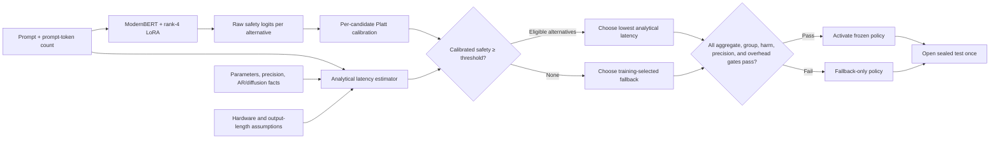

# Calibrated ModernBERT latency-aware LLM router

This proof of concept trains
[`nomic-ai/modernbert-embed-base`](https://huggingface.co/nomic-ai/modernbert-embed-base)
with rank-4 LoRA to estimate whether a faster candidate can preserve the quality
of a strong fallback for each prompt. A deterministic analytical estimator then
selects the lowest-latency candidate predicted safe.

ModernBERT does **not** predict latency and does **not** directly predict the
final model. Candidate latency comes from model size, generation architecture,
precision, prompt size, and explicit hardware assumptions. No candidate LLM is
loaded or timed to construct latency labels.

The project is an analytical-latency feasibility experiment, not a claim about
measured production latency.

The README is the current specification. Development history, earlier results,
and the reasons behind policy changes are kept in [`audits.md`](audits.md).

## Project in one minute

In plain language, the router asks: "Can the faster model answer this prompt
without doing worse than the trusted fallback?" If its calibrated confidence is
high enough and the analytical latency model predicts at least a 2% speedup, it
uses the fastest eligible alternative. Otherwise it safely uses the fallback.

Technically, ModernBERT predicts a separate fallback-relative safety probability
for every non-fallback candidate. The selector combines those probabilities with
analytical latency estimates, then freezes its threshold on validation data
before it opens the sealed test set. The test is successful only if conservative
quality, subgroup, harm, calibration, and latency-overhead gates all pass.

For a simplified numerical example, suppose the fallback answers 80 of 100
prompts correctly. A routed policy answers 79 correctly, so its point-estimate
quality retention is $79/80=98.75\%$. That point estimate alone is insufficient:
the one-sided 95% lower confidence bound must also clear the predeclared 98%
test gate. If faster routing saves 50 ms per prompt before routing cost and the
router costs 4 ms, net analytical savings are $50-4=46$ ms per prompt. The
policy must satisfy both the quality and latency requirements.

## Routing logic



Only the calibrated safety head and analytical latency estimator are deployed.
The hindsight-oracle head is training-only.

## Deployment objective

Let $f$ be the strongest model on training data,
$\widehat P_m(\text{safe}\mid x)$ the calibrated ModernBERT safety estimate,
and $\widehat L_m(x)$ analytical latency. The selector solves:

$$
\pi(x)=\arg\min_m \widehat L_m(x)
$$

subject to:

$$
\widehat P_m(\text{safe}\mid x)\ge\tau,
\qquad
\widehat L_m(x)\le(1-\delta)\widehat L_f(x).
$$

The fallback is always eligible. The default minimum predicted speedup is
$\delta=0.02$. Validation chooses $\tau$ and activates the router only when:

$$
\operatorname{LCB}_{95\%}\left(
\frac{\mathbb E[Q_{\pi(x)}]}{\mathbb E[Q_f]}
\right)\ge0.98
$$

and net analytical latency savings remain positive after router overhead. The
notebook adds a validation-only margin $\gamma=0.01$, so activation requires:

$$
\operatorname{LCB}_{95\%,validation}\ge 0.98+\gamma=0.99.
$$

The sealed-test pass criterion is 0.98. The margin is not added to the test
after results are seen; it is a predeclared guard against validation optimism.

The current threshold-selection contract additionally requires:

$$
\begin{aligned}
\operatorname{LCB}_{95\%,macro} &\ge 0.98,\\
\operatorname{UCL}_{95\%}(P(\text{quality loss})) &\le 0.025,\\
\operatorname{LCB}_{95\%}(P(\text{safe}\mid\text{routed})) &\ge 0.90,\\
\min_{d:\,N_d\ge100}\operatorname{LCB}_{95\%,d} &\ge 0.90.
\end{aligned}
$$

Net analytical savings must also stay positive when router overhead is replaced
by the conservative 20 ms assumption. These are configurable command-line and
Python parameters, but their chosen values must be frozen before opening test.

## Loss: what the router learns

### Plain-language intuition

The router is trained as a safety judge, not as an answer generator. For every
faster candidate, it learns whether choosing that candidate would preserve the
fallback's recorded quality. A separate training-only oracle teaches the shared
representation which safe choice would have been fastest, but that oracle is
never available when routing a new prompt.

For example, if the fallback scores 1 and Fin-R1 scores 0, Fin-R1 receives an
unsafe label of 0. If both score 1, it receives a safe label of 1. If both score
0, it also receives a safe label under the default fallback-relative definition:
the replacement did not make the fallback's result worse, even though neither
model answered correctly. This distinction is why the loss estimates safe
replacement rather than absolute correctness.

### Technical definition

The router does **not** estimate absolute answer quality, latency, or the final
model choice. For each non-fallback candidate, it estimates the probability
that the candidate is a safe replacement for the strongest model selected on
the training split:

$$
\widehat P_m(\text{safe}\mid x)
=P\!\left(Q_m(x)\ge Q_f(x)-\epsilon_q
\mid\text{prompt text, prompt-token count}\right).
$$

Here, $Q_m(x)$ is candidate $m$'s recorded benchmark quality and $Q_f(x)$ is
the fallback's quality. The binary training target is:

$$
y_m(x)=\mathbf 1[Q_m(x)\ge Q_f(x)-\epsilon_q].
$$

Thus, $y_m=1$ means the candidate preserved fallback-relative quality, while
$y_m=0$ means that routing to it would lose more than the allowed tolerance.
The default is $\epsilon_q=0$, so the candidate must match or exceed the
fallback's recorded score. These are independent binary labels: with more than
one alternative, several candidates may be safe for the same prompt.

### Safety loss

The safety loss uses independent binary cross-entropy with a per-candidate
positive weight $N_{unsafe}/N_{safe}$, clipped to `[0.10, 10.0]`:

$$
\mathcal L_{safety}=\frac{1}{N(M-1)}
\sum_{x,m}\left[-w_my_m\log p_m-(1-y_m)\log(1-p_m)\right],
\qquad p_m=\sigma(s_m).
$$

For example, suppose Fin-R1 is safe on 20 of 100 training prompts. Its positive
weight is:

$$
w_{Fin}=\frac{80\text{ unsafe}}{20\text{ safe}}=4.
$$

If a safe prompt receives predicted probability $p=0.8$, its unweighted BCE is
$-\log(0.8)=0.223$. After class balancing, its contribution is
$4\times0.223=0.892$. This prevents the model from obtaining a deceptively low
loss by predicting "unsafe" for nearly every prompt when safe replacements are
rare.

### Training-only oracle loss

The hindsight oracle can see recorded outcomes and chooses the fastest model
that preserves fallback-relative quality:

$$
o(x)=\arg\min_m\widehat L_m(x)
\quad\text{subject to}\quad
Q_m(x)\ge Q_f(x)-\epsilon_q.
$$

Its auxiliary loss combines oracle imitation, expected quality risk, and
normalized latency regret:

$$
\mathcal L_{oracle}=(1+g_o)CE(z,o)
+4\sum_m p_m d_m+\sum_m p_m r_m.
$$

Here, $g_o=(L_f-L_o)/L_f$ is the non-negative latency opportunity available
from the oracle choice, $d_m=\max(Q_f-Q_m-\epsilon_q,0)$ is quality drop, and
$r_m=\max((L_m-L_o)/L_f,0)$ is normalized latency regret. The factor 4 makes
probability assigned to a quality-losing model more expensive than probability
assigned to a merely slower model.

For a numerical example, suppose Fin-R1 and the Qwen fallback both score 1 on a
prompt, but their analytical latencies are 0.70 s and 1.00 s. Fin-R1 is the
oracle and the available speedup is $g_o=(1.00-0.70)/1.00=0.30$. If the oracle
head assigns probabilities `[0.8, 0.2]` to `[Fin-R1, Qwen]`, then:

$$
\begin{aligned}
\text{oracle imitation} &=1.30[-\log(0.8)]=0.290,\\
\text{quality risk} &=0,\\
\text{latency regret} &=0.2\frac{1.00-0.70}{1.00}=0.060,\\
\mathcal L_{oracle} &=0.290+0+0.060=0.350.
\end{aligned}
$$

If Fin-R1 instead scored 0 while Qwen scored 1, Fin-R1 would be unsafe and the
oracle would choose Qwen despite its higher latency. Assigning probability to
Fin-R1 would then incur the quality-risk penalty, illustrating that preserving
quality takes priority over saving latency.

### Complete training loss

The complete objective is:

$$
\boxed{\mathcal L_{train}=\mathcal L_{safety}
+0.25\mathcal L_{oracle}}.
$$

Continuing the safe-prompt example and assuming its candidate class weight is
$w_m=1$, the safety loss is $0.223$ and:

$$
\mathcal L_{train}=0.223+0.25(0.350)=0.3105\approx0.311.
$$

The safety head is the deployed prediction. The oracle head only shapes the
shared ModernBERT representation during training and is not consulted by the
production selector. The loss is therefore a differentiable training proxy for
the real objective: minimize latency subject to preserving fallback quality.

The LoRA adapter uses learning rate $10^{-4}$ while the randomly initialized
heads use $2\times10^{-4}$. Notebook training can run for at most eight epochs,
but stops
after two consecutive non-improving validation epochs once at least two epochs
have completed. The command-line default is five maximum epochs with the same
minimum-epoch and patience settings.

After checkpoint selection, each candidate receives a Platt scaler. Validation
rows use out-of-fold calibrated probabilities during threshold selection, so an
example never calibrates its own confidence. Final deployment parameters are
fitted on all validation rows and saved in the artifact.

## Analytical latency

For active parameters $P_m$, effective compute $F$, memory bandwidth $B$,
and precision $b$:

$$
t_{compute/token}=\frac{2P_m}{F},
\qquad
t_{memory/pass}=\frac{P_m b/8}{B}.
$$

Prefill depends on prompt length. Autoregressive decoding uses one sequential
weight pass per expected output token. Diffusion decoding uses declared
denoising passes per generated block. Expected output length depends only on
prompt size:

$$
\widehat n_{out}=\operatorname{clip}(a+cn,n_{min},n_{max}).
$$

Realized completion length is excluded. The notebook changes every recorded
completion length by 100× and asserts that analytical latency is unchanged.

## Default candidate panel

The clean default uses two benchmark candidates:

| Candidate | Role | Declared facts |
|---|---|---|
| `Fin-R1` | faster replacement | 7.0B, autoregressive, BF16 |
| `Qwen3-8B` | potential fallback | 8.2B, autoregressive, BF16 |

Qwen's official model card reports 8.2B parameters:
[`Qwen/Qwen3-8B`](https://huggingface.co/Qwen/Qwen3-8B).

The public benchmark pool contains no diffusion model. Do not relabel an
autoregressive candidate as diffusion. Add a diffusion candidate only when its
pre-collected quality results and sourced inference settings are available.

## Two experiments, two different claims

### 1. Random-split feasibility

Five stratified group folds produce an approximate 60/20/20 train, validation,
and test split. The group key is SHA-256 of the NFKC-normalized prompt after
normalizing line endings and removing trailing whitespace. Case and leading
indentation remain significant because changing them can alter code semantics.

Thus, two source records with different IDs but the same normalized prompt must
remain in one split. For example, `mmlupro::test_1000::17` and
`mmlupro::test_3000::17` cannot enter train and test separately if their prompt
content is identical. This experiment asks whether prompt content contains
enough signal for safe replacement and remains the default notebook mode.

### 2. Dataset-OOD stress test

Entire datasets are disjoint across train, validation, and test. This asks
whether the learned relationship generalizes to unseen domains. Run it as a
separate artifact only after random feasibility succeeds.

Repeat both modes with at least seeds 42, 43, and 44 before making a stability
claim. A random pass with an OOD failure proves feasibility, not cross-domain
generalization.

## Train entirely in Google Colab

[Open notebook 02 in Google Colab](https://colab.research.google.com/github/BrunoVitti96/LLM-router/blob/develop/notebooks/02_train_modernbert_hybrid_poc.ipynb)

1. Select **Runtime → Change runtime type → GPU**.
2. Run every cell from top to bottom with `SPLIT_MODE = "random"`.
3. Download the generated random-split ZIP.
4. Repeat with additional seeds.
5. Only then change to `SPLIT_MODE = "dataset_ood"` and create separate ZIPs.

The notebook downloads LLMRouterBench, checks candidate names, proves
completion-length leakage is absent, audits prompt-content groups, runs
validation-only sensitivity scenarios, trains and calibrates ModernBERT with
early stopping, freezes the policy with a validation safety margin, opens the
sealed test, and exports a reconstructable artifact plus report. The canonical
notebook is intentionally stored without execution output; the downloaded ZIP
is the run record.

The resolver may warn about Colab's unused Gradio installation. That warning is
not a router-training failure.

## Exported report

The report directory contains:

- `strategy_summary.csv`: baselines, oracle, router, and oracle-savings capture;
- `threshold_search.csv`: validation quality/savings frontier;
- `candidate_diagnostics.csv`: quality, safety, speed, and oracle-selection rate
  by split and candidate;
- `per_dataset_metrics.csv`: strategy quality, savings, harm bounds, and routing
  behavior for every sealed-test dataset;
- `validation_sensitivity.csv`: validation-only oracle headroom across analytical
  hardware and output-length assumptions;
- `test_router_overhead_sensitivity.csv`: the frozen test policy under several
  router-overhead assumptions;
- `test_decisions.parquet`: sealed-test prompt-level decisions;
- `experiment_manifest.json`: analytical assumptions and explicit POC status;
- `modernbert_router/training_history.csv`;
- `modernbert_router/calibration_diagnostics.csv`;
- `modernbert_router/input_diagnostics.json`;
- exported Platt parameters, LoRA adapter, heads, tokenizer, and router manifest.

The current `test_decisions.parquet` schema also stores
`safety_probability__<model>` for every candidate plus `router_input_tokens`
and `router_was_truncated`. Thus, if
48 routes are harmful, the report can show whether they were high-confidence
errors or disproportionately truncated prompts. `strategy_summary.csv` and
`threshold_search.csv` add routed-precision LCB, safe-opportunity recall,
guarded-dataset retention, and conservative-overhead savings.

`poc_passed` is true only when the frozen policy also passes every sealed-test
quality, savings, and non-trivial-routing criterion. Failure reasons are written
explicitly; a fallback-only result is not a successful router. The exported
artifact sets `deployment_enabled` only when both validation activation and the
sealed-test POC gate pass.

## Command-line equivalents

Feasibility:

```bash
llm-router-benchmark \
  --data-root /path/to/LLMRouterBench \
  --scenario configs/my_analytical_scenario.json \
  --models Fin-R1,Qwen3-8B \
  --objective latency \
  --split-mode random \
  --router modernbert-hybrid \
  --epochs 5 \
  --minimum-macro-quality-retention 0.98 \
  --maximum-quality-loss-rate-ucl 0.025 \
  --minimum-routed-safety-precision-lcb 0.90 \
  --minimum-guarded-dataset-quality-retention-lcb 0.90 \
  --minimum-guarded-dataset-prompts 100 \
  --conservative-router-overhead-ms 20 \
  --output-dir reports_benchmark/random_seed_42
```

Generalization stress test:

```bash
llm-router-benchmark \
  --data-root /path/to/LLMRouterBench \
  --scenario configs/my_analytical_scenario.json \
  --models Fin-R1,Qwen3-8B \
  --objective latency \
  --split-mode dataset_ood \
  --router modernbert-hybrid \
  --epochs 5 \
  --output-dir reports_benchmark/dataset_ood_seed_42
```

`--router tfidf` remains a cheap diagnostic baseline.

## What counts as a credible POC

- validation-only oracle headroom remains positive across sensitivity scenarios;
- every retained alternative has a non-zero oracle-selection rate;
- calibrated ModernBERT routes a non-trivial sealed-test fraction;
- the sealed-test 95% quality-retention LCB is at least 98%;
- the random split is disjoint by normalized prompt content, not only record ID;
- per-dataset retention and the harm-rate upper bound are reported;
- macro retention, routed-precision LCB, and the guarded worst-dataset floor
  pass their predeclared gates;
- net analytical savings remain positive after router overhead;
- net analytical savings also remain positive at the conservative overhead;
- random feasibility passes across several seeds; and
- dataset-OOD results are reported separately and honestly.

Production still requires calibrating analytical constants with a small aggregate
hardware study. That is different from timing every candidate for every prompt.

## Repository layout

```text
README.md                                   # current project specification
audits.md                                   # historical runs and design changes

notebooks/
├── 01_train_modernbert_router.ipynb       # historical measured-latency run
└── 02_train_modernbert_hybrid_poc.ipynb   # recommended calibrated Colab POC

src/llm_router/
├── analytical_latency.py       # measurement-free latency equations
├── oracle.py                   # balanced safety and auxiliary oracle losses
├── modernbert_poc.py           # training, calibration, and artifact export
├── public_benchmark.py         # policy selection and sealed evaluation
├── benchmark_cli.py            # optional command-line driver
└── models/modernbert_router.py # ModernBERT + LoRA heads
```

## Development checks

```bash
pytest
python -m compileall -q src
ruff check .
```
