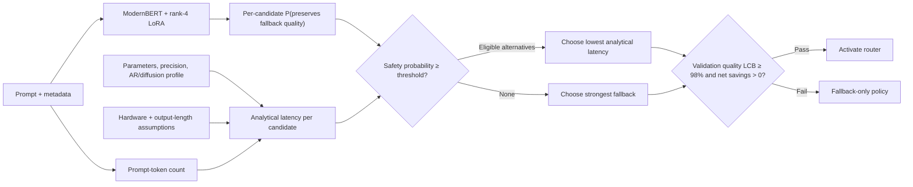

# Hybrid ModernBERT latency-aware LLM router

This proof of concept trains
[`nomic-ai/modernbert-embed-base`](https://huggingface.co/nomic-ai/modernbert-embed-base)
with rank-4 LoRA to predict whether each candidate LLM can preserve the quality
of a strong fallback for a given prompt. A deterministic analytical estimator
then chooses the lowest-latency candidate predicted safe.

ModernBERT does **not** predict latency and does **not** directly predict the
final model. Candidate latency comes from model size, autoregressive versus
diffusion architecture, precision, hardware assumptions, and prompt size. No
candidate LLM is loaded or timed to build latency labels.

This is a feasibility and sensitivity-analysis experiment, not a claim of
measured production latency.

## Routing logic



At deployment, only the safety head is used. The training-only oracle head helps
ModernBERT learn decision-relevant representations but never chooses a model.

## Deployment objective

Let (f) be the strongest model on the training split, let
(widehat P_m(safe\mid x)) be ModernBERT's fallback-relative safety estimate,
and let (widehat L_m(x)) be analytical latency. The per-prompt selector is:

$$
\pi(x)=\arg\min_m \widehat L_m(x)
$$

subject to:

$$
\widehat P_m(safe\mid x)\ge\tau,
\qquad
\widehat L_m(x)\le(1-\delta)\widehat L_f(x).
$$

The fallback is always eligible. The default minimum predicted speedup is
(delta=0.02). Validation selects (	au), and the router is activated only if:

$$
\operatorname{LCB}_{95\%}\left(
\frac{\mathbb E[Q_{\pi(x)}]}{\mathbb E[Q_f]}
\right)\ge0.98
\quad\text{and}\quad
1-\frac{\mathbb E[\widehat L_{\pi(x)}+L_{router}]}{
\mathbb E[\widehat L_f]}>0.
$$

This separates the two responsibilities cleanly: ModernBERT estimates quality
safety; the analytical model supplies latency; a deterministic constrained
optimizer makes the final choice.

## Training targets and loss

Pre-collected benchmark outcomes provide quality supervision. For every prompt
and non-fallback candidate:

$$
y_m(x)=\mathbf 1[Q_m(x)\ge Q_f(x)-\epsilon_q].
$$

The deployed safety head emits independent logits (s_m) and uses binary
cross-entropy:

$$
\mathcal L_{safety}=
\frac{1}{N(M-1)}\sum_{x,m}
BCEWithLogits(s_m(x),y_m(x)).
$$

### What the oracle means

The hindsight oracle is available only during training and retrospective
evaluation. Because it can see all recorded quality outcomes, it chooses:

$$
o(x)=\arg\min_m\widehat L_m(x)
\quad\text{subject to}\quad
Q_m(x)\ge Q_f(x)-\epsilon_q.
$$

An auxiliary head produces oracle-class logits (z), with
(p=softmax(z)). Its decision-alignment loss is:

$$
\mathcal L_{oracle}=
(1+g_o)CE(z,o)
+4\sum_m p_m d_m
+\sum_m p_m r_m,
$$

where:

$$
g_o=\max\left(0,\frac{\widehat L_f-\widehat L_o}{\widehat L_f}\right),
\quad
d_m=\max(0,Q_f-Q_m-\epsilon_q),
\quad
r_m=\max\left(0,\frac{\widehat L_m-\widehat L_o}{\widehat L_f}\right).
$$

- Cross-entropy teaches the ideal hindsight decision and emphasizes larger safe
  opportunities.
- Expected quality risk penalizes probability placed on quality-losing models.
- Latency regret penalizes probability placed on models slower than the oracle.

The complete loss is:

$$
\boxed{
\mathcal L_{train}=
1.0\,\mathcal L_{safety}
+0.25\,\mathcal L_{oracle}
}
$$

The oracle term is auxiliary. Changing hardware assumptions changes analytical
selection without requiring the deployed safety target to be redefined.

## Analytical latency

For active parameter count (P_m), prompt tokens (n), effective compute (F),
memory bandwidth (B), and weight precision (b):

$$
t_{compute/token}=\frac{2P_m}{F},
\qquad
t_{memory/pass}=\frac{P_m b/8}{B}.
$$

Prefill is approximated as (n\,t_{compute/token}). Autoregressive decoding
uses one sequential pass per expected output token. Diffusion decoding uses the
declared denoising steps per generated block. Expected output length is derived
only from prompt size:

$$
\widehat n_{out}=clip(a+cn,n_{min},n_{max}).
$$

Realized completion length is deliberately excluded. The notebook contains an
assertion proving that changing every recorded completion length does not change
analytical latency.

## Train entirely in Google Colab

Open the recommended notebook directly:

[Open the hybrid ModernBERT notebook in Colab](https://colab.research.google.com/github/BrunoVitti96/LLM-router/blob/develop/notebooks/02_train_modernbert_hybrid_poc.ipynb)

Then:

1. Select **Runtime → Change runtime type → GPU**.
2. Run the notebook from top to bottom.
3. In the clearly marked configuration cell, replace the model-profile
   placeholders with exact model directory names shown by the inventory cell and
   their sourced parameter/architecture facts.

The notebook itself:

- clones the `develop` branch;
- installs the package;
- downloads and extracts the official pre-collected LLMRouterBench archive from
  Hugging Face;
- checks candidate names and analytical assumptions;
- verifies completion-length leakage is absent;
- creates dataset-disjoint train, validation, and sealed-test splits;
- shows validation-only oracle headroom before training;
- trains ModernBERT with LoRA;
- selects the safety threshold using validation only;
- opens the test split after policy freeze; and
- exports reports, the LoRA adapter, both heads, tokenizer, and manifest; then
- packages everything as a ZIP and starts a browser download before the Colab
  runtime is discarded.

No CLI or separate candidate-inference notebook is required.

## Command-line equivalent

The same hybrid workflow is available after installing the project:

```bash
pip install -e ".[dev]"

llm-router-benchmark \
  --data-root /path/to/LLMRouterBench \
  --scenario configs/my_analytical_scenario.json \
  --models model-a,model-b,model-c \
  --objective latency \
  --split-mode dataset_ood \
  --router modernbert-hybrid \
  --epochs 5 \
  --output-dir reports_benchmark/modernbert_hybrid_ood
```

`--router tfidf` remains available as a cheap diagnostic baseline.

## What counts as a successful POC

- The outcome-aware oracle demonstrates material latency headroom.
- ModernBERT routes a non-trivial fraction away from the fallback.
- The sealed-test one-sided 95% quality-retention lower bound reaches 98%.
- Net analytical latency savings remain positive after router overhead.
- The result remains stable across reasonable hardware, response-length, and
  diffusion-step sensitivity scenarios.

These findings do not prove production latency. A production phase should
calibrate analytical constants using a small aggregate hardware study rather
than timing every candidate on every prompt.

## Repository layout

```text
notebooks/
├── 01_train_modernbert_router.ipynb       # historical measured-latency run
└── 02_train_modernbert_hybrid_poc.ipynb   # recommended Colab workflow

src/llm_router/
├── analytical_latency.py       # measurement-free latency equations
├── oracle.py                   # safety targets and auxiliary oracle loss
├── modernbert_poc.py           # hybrid training and artifact export
├── public_benchmark.py         # policy selection and sealed evaluation
├── benchmark_cli.py            # optional command-line driver
└── models/modernbert_router.py # ModernBERT + LoRA heads
```

The historical v4 notebook and scope document remain only for measured-latency
reproduction. They are not the recommended POC path.

## Development checks

```bash
pytest
python -m compileall -q src
ruff check .
```
