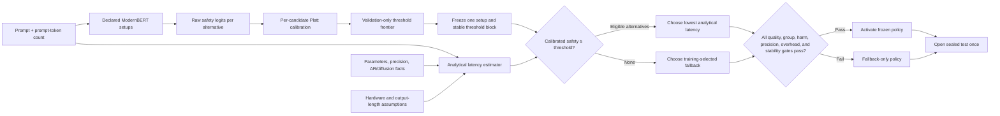

# Calibrated ModernBERT router for three Qwen capacity tiers

The recommended v5 diagnostic proof of concept loads reproducible, published per-example
quality evidence for three separated Qwen2.5 tiers—1.54B, 3.09B, and 7.61B
parameters—then
trains
[`nomic-ai/modernbert-embed-base`](https://huggingface.co/nomic-ai/modernbert-embed-base)
with lightweight LoRA adapters to estimate whether a faster candidate can
preserve the quality of a strong fallback for each prompt. V5 keeps v4's
class-balanced replacement-safety loss, trains rank-4 LoRA for all five epochs,
and restores the epoch with the lowest validation safety loss. It compares the
old 512-token prefix with a 1,024-token prefix and a 1,024-token head-plus-tail
representation. The oracle head
and loss implementation remain present for compatibility, but their coefficient
is exactly zero. A deterministic analytical estimator selects the lowest-latency
candidate predicted safe.

ModernBERT does **not** predict latency and does **not** directly predict the
final model. Candidate latency comes from model size, generation architecture,
precision, prompt size, and explicit hardware assumptions. No candidate LLM is
loaded or timed in v5. Quality comes from pinned Hugging Face Open LLM
Leaderboard detail datasets; published runtime is neither a routing target nor
used by the selector.

The project is an analytical-latency feasibility experiment, not a claim about
measured production latency.

The README is the current specification. Development history, earlier results,
and the reasons behind policy changes are kept in [`audits.md`](audits.md).

## Project in one minute

In plain language, the router asks: "Can the faster model answer this prompt
without doing worse than the trusted fallback?" If its calibrated confidence is
high enough and the analytical latency model predicts at least a 2% speedup, it
uses the fastest eligible alternative. Otherwise it safely uses the fallback.

Technically, ModernBERT predicts two separate fallback-relative safety
probabilities, one for each non-fallback Qwen tier. The selector combines those
probabilities with analytical latency estimates. V5 trains three input variants,
prints loss after every optimizer mini-batch, restores each variant's
best of five validation checkpoints, selects one variant using validation only,
freezes one stable threshold
region, and then opens the sealed test exactly once. The test is successful only if
conservative quality, subgroup, harm, calibration, threshold-stability, and
latency-overhead gates all pass.

The v5 notebook provides random and dataset-OOD modes at
seeds 42, 43, and 44. It deterministically keeps at most 300 aligned prompts from
each of 37 non-overlapping published tasks: at most 11,100 prompts and 33,300
prompt-model outcomes, reused across split seeds.
One Colab session compares all three representations for one named split and exports one ZIP. ModernBERT
batch-one overhead is measured on the active Colab GPU. Candidate generation is
not timed for routing, so candidate latency remains analytical. The router timing
is diagnostic and cannot retroactively change the frozen 4 ms and 20 ms gates.

For a simplified numerical example, suppose the fallback answers 80 of 100
prompts correctly. A routed policy answers 79 correctly, so its point-estimate
quality retention is $79/80=98.75\%$. That point estimate alone is insufficient:
the one-sided 95% lower confidence bound must also clear the predeclared 98%
test gate. If faster routing saves 50 ms per prompt before routing cost and the
router costs 4 ms, net analytical savings are $50-4=46$ ms per prompt. The
policy must satisfy both the quality and latency requirements.

Notebook 03's seed-42 validation comparison motivated v4: rank-4 safety-only
training beat rank-4 and rank-8 hybrid training on calibration, safe-opportunity
recall, and conservative analytical savings. V4 treats that result as exploratory
model-selection evidence and starts a new versioned safety-only study rather than
silently changing the remaining v3 runs after a sealed test was observed.

## Current evidence: notebook 04 exposes an OOD generalization failure

The latest completed run is the dataset-OOD seed-42 execution saved in
[`04_train_modernbert_qwen_tiers_safety_only_v4.ipynb`](notebooks/04_train_modernbert_qwen_tiers_safety_only_v4.ipynb).
Training loss fell from 0.2220 to 0.2023, while validation loss moved
0.2390, 0.2414, 0.2360, 0.2408, and 0.2411. Epoch 3 was correctly retained.
In plain language, the router learned its training tasks but did not improve
steadily on unseen tasks. Validation ROC-AUC was only 0.5467, close to random
ranking, so additional epochs alone are not the appropriate fix.

The 512-token input truncated 64.26% of examples. On the sealed test, every one
of the 588 routed prompts was truncated and none of the 500 non-truncated prompts
was routed. The 1.5B routes gained 13 answers and lost none; the 3B routes gained
28 but lost 35, for -7 net. The run failed its macro-quality and harm-bound gates
and remained guarded. These facts do not prove truncation caused the failure,
but they make input representation the highest-value controlled test.

Notebook 03 remains historical random-split evidence: it routed 636 of 1,726
test prompts, estimated 28.24% analytical savings at 20 ms overhead, and finished
eight answers ahead of fallback, but still failed its macro-dataset gate. Neither
single seed supports a production or universal-generalization claim.

## V5 status: first execution exposed a compile/thread incompatibility

[`05_train_modernbert_input_representation_ood_v5.ipynb`](notebooks/05_train_modernbert_input_representation_ood_v5.ipynb)
holds the loss, LoRA capacity, split, seed, calibration, thresholds, gates, and
five-epoch checkpoint rule fixed while comparing:

| Variant | Token budget | Kept content | Question isolated |
|---|---:|---|---|
| `prefix_512` | 512 | first 512 tokens | reproduces the v4 input baseline |
| `prefix_1024` | 1,024 | first 1,024 tokens | tests token budget alone |
| `head_tail_1024` | 1,024 | prompt beginning and ending | tests whether discarded tail content matters |

For a 1,600-token encoded prompt, `prefix_512` discards 1,088 tokens,
`prefix_1024` discards 576, and `head_tail_1024` keeps approximately 512 tokens
from each end. Validation selects the representation; only that winner is
allowed to open the sealed test. V5 has no results yet, so no chart or claim in
the notebook should be presented as observed evidence until it is executed and
its ZIP is retained.

The first Colab attempt reached the fifth training epoch but stopped before
representation selection with `Detected that you are using FX to symbolically
trace a dynamo-optimized function`. The traceback entered ModernBERT's optional
compiled MLP from one of the three worker threads. This was an execution-backend
failure, not a failed quality gate: the sealed test was never opened and no v5
result was produced.

The router now loads ModernBERT with `reference_compile=False` for training and
artifact inference. In plain language, the three workers use the ordinary eager
encoder instead of asking PyTorch to compile encoder fragments concurrently.
Technically, Transformers 4.53.1 otherwise enables `torch.compile(dynamic=True)`
when Triton is present, while PyTorch Dynamo/FX compilation uses process-global
state that is unsafe under this threaded workload. The eager path evaluates the
same attention, MLP, pooling, LoRA, and heads; it trades the optional compile
speedup for a stable run. With three variants and five epochs, the experiment
still performs $3\times5=15$ model-epochs and retains one validation-best
checkpoint per variant. A clean rerun is required before claiming results.

V5 requests three concurrent workers on one GPU because the v4 run left memory
headroom. A coarse preflight requires at least 14 GiB total GPU memory and 80%
free memory; otherwise it runs sequentially. Each parallel worker uses batch
size 4 and model construction is serialized to avoid simultaneous download and
initialization spikes. Parallelism reduces wall-clock time only if compute and
memory bandwidth remain available—it does not make one GPU equivalent to three.
If CUDA still reports out-of-memory, restart the runtime, set
`PARALLEL_TRAINING_REQUESTED=False`, and rerun.

The v5 artifact contract records `modernbert_reference_compile=false`. This
switch changes only the encoder execution backend; it does not change the
safety labels, class-balanced BCE, LoRA rank, optimizer, calibration, policy
gates, or analytical latency model.

The shared safety-only training contract is:

| Contract item | V5 value | Practical meaning |
|---|---:|---|
| Active loss | safety BCE only | Directly predicts fallback-relative safety |
| Oracle coefficient | 0.0 | Oracle code exists but supplies zero gradient |
| LoRA rank / alpha | 4 / 8 | Uses the winning v3 capacity setup |
| Epochs | 5 | Every epoch runs; early stopping is disabled |
| Training log | every optimizer mini-batch | Preserves the v4 live-loss contract; lines name their variant |
| Checkpoint | minimum validation safety loss | Later epochs cannot overwrite a better earlier model |
| Default split | dataset-OOD seed 42 | Tests transfer to unseen tasks |

For example, if validation safety loss is lowest at epoch 3 and rises from
0.205 at epoch 3 to 0.219 at epoch 5, the exported router uses epoch 3 even
though the training loop completed all five epochs.

## Routing logic



Only the calibrated safety head and analytical latency estimator are deployed.
The hindsight-oracle head is retained but inactive in v4: its coefficient is
zero during training and it is not consulted at inference.

## Deployment objective

Let $f$ be the strongest model on training data,
$\widehat P_m(\text{safe}\mid x)$ the calibrated ModernBERT safety estimate,
and $\widehat L_m(x)$ analytical latency. The selector solves:

$$
\pi(x)=\arg\min_m \widehat L_m(x)
$$

subject to:

$$
\widehat P_m(\text{safe}\mid x)\ge\tau,
\qquad
\widehat L_m(x)\le(1-\delta)\widehat L_f(x).
$$

The fallback is always eligible. The default minimum predicted speedup is
$\delta=0.02$. Validation chooses $\tau$ and activates the router only when:

$$
\operatorname{LCB}_{95\%}\left(
\frac{\mathbb E[Q_{\pi(x)}]}{\mathbb E[Q_f]}
\right)\ge0.98
$$

and net analytical latency savings remain positive after router overhead. The
notebook adds a validation-only margin $\gamma=0.01$, so activation requires:

$$
\operatorname{LCB}_{95\%,validation}\ge 0.98+\gamma=0.99.
$$

The sealed-test pass criterion is 0.98. The margin is not added to the test
after results are seen; it is a predeclared guard against validation optimism.

The current threshold-selection contract additionally requires:

$$
\begin{aligned}
\operatorname{LCB}_{95\%,macro} &\ge 0.98,\\
\operatorname{UCL}_{95\%}(P(\text{quality loss})) &\le 0.025,\\
\operatorname{LCB}_{95\%}(P(\text{safe}\mid\text{routed})) &\ge 0.90,\\
\min_{d:\,N_d\ge100}\operatorname{LCB}_{95\%,d} &\ge 0.90.
\end{aligned}
$$

Net analytical savings must also stay positive when router overhead is replaced
by the conservative 20 ms assumption. These are configurable command-line and
Python parameters, but their chosen values must be frozen before opening test.

Schema v5 also requires a contiguous block of at least two feasible threshold
grid values. Let $g_i=1$ when threshold $\tau_i$ passes every gate. Activation
requires a consecutive run with length at least two:

$$
\max_{a\le b}\left\{b-a+1:\prod_{i=a}^{b}g_i=1\right\}\ge2.
$$

For example, if only `0.910` passes, its feasible block size is one and the
router remains fallback-only. If `0.905` and `0.910` both pass, the block size
is two and the stability gate passes. This prevents a 0.005 threshold change
from silently moving the policy from safe to unsafe or from profitable to
unprofitable.

## Loss: what the router learns

### Plain-language intuition

The router is trained as a safety judge, not as an answer generator. For every
faster candidate, it learns whether choosing that candidate would preserve the
fallback's recorded quality. Notebook 03 historically tested a separate
training-only oracle, but v4 keeps it inactive and learns only this safety task.

For example, if the Qwen2.5-7B fallback scores 1 and Qwen2.5-1.5B scores 0, the
1.5B tier receives an unsafe label of 0. If both score 1, it receives a safe
label of 1. If both score 0, it also receives a safe label under the default
fallback-relative definition:
the replacement did not make the fallback's result worse, even though neither
model answered correctly. This distinction is why the loss estimates safe
replacement rather than absolute correctness.

### Technical definition

The router does **not** estimate absolute answer quality, latency, or the final
model choice. For each non-fallback candidate, it estimates the probability
that the candidate is a safe replacement for the strongest model selected on
the training split:

$$
\widehat P_m(\text{safe}\mid x)
=P\!\left(Q_m(x)\ge Q_f(x)-\epsilon_q
\mid\text{prompt text, prompt-token count}\right).
$$

Here, $Q_m(x)$ is candidate $m$'s recorded benchmark quality and $Q_f(x)$ is
the fallback's quality. The binary training target is:

$$
y_m(x)=\mathbf 1[Q_m(x)\ge Q_f(x)-\epsilon_q].
$$

Thus, $y_m=1$ means the candidate preserved fallback-relative quality, while
$y_m=0$ means that routing to it would lose more than the allowed tolerance.
The default is $\epsilon_q=0$, so the candidate must match or exceed the
fallback's recorded score. These are independent binary labels: with more than
one alternative, several candidates may be safe for the same prompt.

### Safety loss

The safety loss uses independent binary cross-entropy with a per-candidate
positive weight $N_{unsafe}/N_{safe}$, clipped to `[0.10, 10.0]`:

$$
\mathcal L_{safety}=\frac{1}{N(M-1)}
\sum_{x,m}\left[-w_my_m\log p_m-(1-y_m)\log(1-p_m)\right],
\qquad p_m=\sigma(s_m).
$$

For example, suppose Qwen2.5-1.5B is safe on 20 of 100 training prompts. Its positive
weight is:

$$
w_{1.5B}=\frac{80\text{ unsafe}}{20\text{ safe}}=4.
$$

If a safe prompt receives predicted probability $p=0.8$, its unweighted BCE is
$-\log(0.8)=0.223$. After class balancing, its contribution is
$4\times0.223=0.892$. This prevents the model from obtaining a deceptively low
loss by predicting "unsafe" for nearly every prompt when safe replacements are
rare.

### Inactive compatibility oracle loss

The hindsight oracle can see recorded outcomes and chooses the fastest model
that preserves fallback-relative quality:

$$
o(x)=\arg\min_m\widehat L_m(x)
\quad\text{subject to}\quad
Q_m(x)\ge Q_f(x)-\epsilon_q.
$$

Its auxiliary loss combines oracle imitation, expected quality risk, and
normalized latency regret:

$$
\mathcal L_{oracle}=(1+g_o)CE(z,o)
+4\sum_m p_m d_m+\sum_m p_m r_m.
$$

Here, $g_o=(L_f-L_o)/L_f$ is the non-negative latency opportunity available
from the oracle choice, $d_m=\max(Q_f-Q_m-\epsilon_q,0)$ is quality drop, and
$r_m=\max((L_m-L_o)/L_f,0)$ is normalized latency regret. The factor 4 makes
probability assigned to a quality-losing model more expensive than probability
assigned to a merely slower model.

For a numerical example, suppose Qwen2.5-1.5B and the Qwen2.5-7B fallback both
score 1 on a prompt, but their analytical latencies are 0.40 s and 1.00 s. The
1.5B tier is the oracle and the available speedup is
$g_o=(1.00-0.40)/1.00=0.60$. If the oracle head assigns probabilities
`[0.8, 0.2]` to `[Qwen2.5-1.5B, Qwen2.5-7B]`, then:

$$
\begin{aligned}
\text{oracle imitation} &=1.60[-\log(0.8)]=0.357,\\
\text{quality risk} &=0,\\
\text{latency regret} &=0.2\frac{1.00-0.40}{1.00}=0.120,\\
\mathcal L_{oracle} &=0.357+0+0.120=0.477.
\end{aligned}
$$

If the 1.5B tier instead scored 0 while the 7B tier scored 1, the 1.5B tier would
be unsafe and the oracle would choose 7B despite its higher latency. Assigning
probability to 1.5B would then incur the quality-risk penalty, illustrating that
preserving quality takes priority over saving latency.

V4 keeps this function, the oracle head, and its diagnostics so old artifacts
remain readable, but sets its coefficient to zero. The value may still be
reported as an inactive diagnostic; it contributes no gradient and cannot
change the learned router.

### Current v4 training loss

Notebook 03 historically used the hybrid objective
$\mathcal L_{safety}+0.25\mathcal L_{oracle}$. The v4 and v5 objective is:

$$
\boxed{\mathcal L_{v4}=1.0\mathcal L_{safety}
+0.0\mathcal L_{oracle}=\mathcal L_{safety}}.
$$

Continuing the safe-prompt example and assuming its candidate class weight is
$w_m=1$, the safety loss is $0.223$. Even if the inactive oracle diagnostic is
$0.477$:

$$
\mathcal L_{v4}=0.223+0.0(0.477)=0.223.
$$

The safety head is the deployed prediction. The oracle head neither shapes the
shared ModernBERT representation in v4 nor participates in production
selection. Latency awareness remains in the deterministic selector: among
candidates whose calibrated safety probability clears the frozen threshold, it
chooses the analytically fastest one.

Safety loss alone can support the product objective, but it is not sufficient
evidence by itself. It learns eligibility—“which candidates preserve fallback
quality?”—while the selector supplies the speed ranking. For example, with a
threshold of 0.87, safety probabilities 0.91 for 1.5B and 0.95 for 3B make both
eligible; analytical latencies 0.40 s and 0.65 s select 1.5B. If the probabilities
are 0.82 and 0.92, only 3B is eligible. This succeeds only if probabilities stay
calibrated under domain shift and the analytical latency order matches deployment,
which is why OOD quality bounds and measured target-hardware economics remain
required before scaling.

### What seed 42 says about the oracle auxiliary loss

In plain language, the first loss is the direct job the deployed router must do:
for each smaller candidate, answer yes or no to "will this candidate preserve
fallback quality?" The oracle loss is optional coaching about which complete
model decision would have been fastest in hindsight. Seed 42 says that the
coaching did not help: the rank-4 safety-only setup produced the best validation
policy.

Technically, setting the oracle coefficient to zero changes

$$
\mathcal L_{train}=\mathcal L_{safety}+0.25\mathcal L_{oracle}
$$

to

$$
\boxed{\mathcal L_{train}=\mathcal L_{safety}}.
$$

This does not remove latency awareness from deployment. Analytical latency still
filters candidates and chooses the fastest eligible model after the safety head
has produced calibrated probabilities. It only stops oracle gradients from
altering the shared ModernBERT representation during training.

The seed-42 validation comparison favored `safety_only_r4`: conservative
analytical savings were 30.11%, compared with 19.51% for `hybrid_r4` and 24.85%
for `hybrid_r8`. Safe-opportunity recall was 41.51%, compared with 23.75% and
33.91%. Its calibrated Brier score was also lowest at 0.13119 versus 0.13245 and
0.13220. These are validation comparisons; the sealed test was opened only for
the selected safety-only setup.

Do not compare the displayed total-loss magnitudes across these setups as if
they shared one scale. Seed 42 reported validation total loss near 0.208 for
`safety_only_r4` and 0.603 for the hybrid setups, but the hybrid number contains
an additional non-negative oracle term. A lower safety-only total is partly a
consequence of adding zero oracle loss, not evidence that it is three times more
accurate. The evidence that favors safety-only is the validation policy table—
calibration, quality bounds, routing, recall, and conservative savings—not the
raw cross-objective total-loss comparison.

For a numerical loss example, suppose the 1.5B candidate is safe and receives
probability 0.8, with class weight 1. Its safety BCE is
$-\log(0.8)=0.223$. If the auxiliary oracle loss is 0.48, hybrid training uses
$0.223+0.25(0.48)=0.343$. Safety-only training uses 0.223. The extra 0.120 is
useful only if oracle supervision improves the deployed safety probabilities;
seed 42 found no such validation benefit.

V4 follows the versioned safety-only path. Notebook 03 seed 42 is exploratory
evidence that motivated the change; notebook 04 is a separate experiment
contract and its results must not be described as unchanged confirmations of
the v3 plan. The recommendation still distinguishes disabling from deleting. Using
`oracle_auxiliary_weight=0` retires the oracle from optimization. Deleting the
oracle head and artifact fields is a separate compatibility change and provides
almost no inference saving because that head is already excluded from the
deployed selector.

Notebook 03 used these predeclared validation ablations:

| Setup | LoRA rank | Oracle coefficient | Question answered |
|---|---:|---:|---|
| `hybrid_r4` | 4 | 0.25 | Current hybrid baseline |
| `safety_only_r4` | 4 | 0.00 | Does the oracle auxiliary loss help? |
| `hybrid_r8` | 8 | 0.25 | Does additional adapter capacity help? |

All enabled setups use the same train/validation/test split. Their setup leaderboard,
calibration diagnostics, threshold frontiers, and training curves use validation
only. The selected setup alone is evaluated on sealed-test outcomes.

Notebook 04 intentionally has one enabled setup, `safety_only_r4`. It preserves
the setup-comparison table with one row for artifact-schema compatibility, not
as a claim that v4 repeated the three-way ablation.

Notebook 05 keeps that same safety-only model and compares only its input
representation. All three variants see identical split rows and labels. This is
an input ablation, not a new loss or routing-policy comparison.

Notebook 02's historical dataset-balanced setup assigns every training row from dataset $d$ weight
$1/N_d$ and samples with replacement. After normalization, each of $D$ datasets
therefore supplies expected probability $1/D$ per optimizer draw. The BCE class
weights are calculated from the same dataset-balanced weights so sampling and
loss weighting describe one target distribution. For example, ordinary sampling
from datasets with 800 and 200 prompts draws them approximately 80% and 20% of
the time; dataset-balanced sampling targets 50% and 50%. The tradeoff is higher
variance and more repeated draws from the 200-prompt dataset, which is why it is
an ablation selected on validation rather than an unconditional replacement.

The LoRA adapter uses learning rate $10^{-4}$ while the randomly initialized
heads use $2\times10^{-4}$. V4 and V5 run all five epochs with early stopping disabled,
then restores the checkpoint with the minimum validation safety loss. For
example, if epochs 3 and 5 have validation losses 0.181 and 0.196, the exported
router uses epoch 3 even though training completed epoch 5. Historical notebooks
and the command-line defaults retain their earlier epoch and patience settings.

During each v4 optimizer mini-batch, the notebook prints the current total loss,
active safety loss, and running training-loss average. Since the oracle
coefficient is zero, total loss and safety loss are numerically equal. For
example, a line may report
`step=12/65 loss=0.384210 safety=0.384210 running=0.417832`. Validation loss is
still computed once after the epoch, so
noisy individual steps do not select the checkpoint.
V5 prints every step and prefixes each line with its variant name so interleaved
parallel output remains attributable.

After checkpoint selection, each candidate receives a Platt scaler. Validation
rows use out-of-fold calibrated probabilities during threshold selection, so an
example never calibrates its own confidence. Final deployment parameters are
fitted on all validation rows and saved in the artifact.

## Analytical latency

For active parameters $P_m$, effective compute $F$, memory bandwidth $B$,
and precision $b$:

$$
t_{compute/token}=\frac{2P_m}{F},
\qquad
t_{memory/pass}=\frac{P_m b/8}{B}.
$$

Prefill depends on prompt length. Autoregressive decoding uses one sequential
weight pass per expected output token. Diffusion decoding uses declared
denoising passes per generated block. Expected output length depends only on
prompt size:

$$
\widehat n_{out}=\operatorname{clip}(a+cn,n_{min},n_{max}).
$$

Realized completion length is excluded. The notebook changes every recorded
completion length by 100× and asserts that analytical latency is unchanged.

### What is measured and what remains analytical

Candidate latency remains measurement-free throughout the POC. V3 downloads
published Qwen prompts, responses, and correctness metrics but never loads the
Qwen weights. After validation
freezes the setup and threshold, the notebook measures only the ModernBERT
decision path on up to 100 deterministically sampled validation prompts after 10
warmup requests. It exports model-only and end-to-end batch-one distributions;
end-to-end includes tokenization, host-to-device transfer, and ModernBERT
inference.

For example, suppose a frozen policy's break-even router overhead is 26.9 ms.
A measured ModernBERT p50 of 14 ms is below break-even, while a p95 of 31 ms is
above it. The correct conclusion is that median economics remain viable but tail
latency needs batching, distillation, or a wider candidate latency gap. Neither
measurement changes the analytical candidate estimates or the already-opened
test result.

## Default v3 candidate panel

LLMRouterBench's public lightweight pool contains only roughly 7B–9B models, so
it cannot honestly answer the requested small/middle/strong comparison. V3
therefore aligns pinned Open LLM Leaderboard detail datasets for the closest
official Qwen2.5 instruction-tuned tiers:

| Candidate | Role | Official facts | V3 quality source |
|---|---|---|---|
| `Qwen2.5-1.5B` | small replacement | 1.54B, autoregressive | published per-example details |
| `Qwen2.5-3B` | middle replacement | 3.09B, autoregressive | published per-example details |
| `Qwen2.5-7B` | large, roughly 8B-class potential fallback | 7.61B, autoregressive | published per-example details |

The pinned official model cards are
[`Qwen/Qwen2.5-1.5B-Instruct`](https://huggingface.co/Qwen/Qwen2.5-1.5B-Instruct),
[`Qwen/Qwen2.5-3B-Instruct`](https://huggingface.co/Qwen/Qwen2.5-3B-Instruct),
and
[`Qwen/Qwen2.5-7B-Instruct`](https://huggingface.co/Qwen/Qwen2.5-7B-Instruct).
The corresponding per-example evidence is pinned from
[`1.5B details`](https://huggingface.co/datasets/open-llm-leaderboard/Qwen__Qwen2.5-1.5B-Instruct-details),
[`3B details`](https://huggingface.co/datasets/open-llm-leaderboard/Qwen__Qwen2.5-3B-Instruct-details),
and
[`7B details`](https://huggingface.co/datasets/open-llm-leaderboard/Qwen__Qwen2.5-7B-Instruct-details).
These repositories are auto-gated and require an accepted Hugging Face account
plus read token; accepting access is not the same as running the models.
The v3 analytical serving scenario uses BF16. Claiming 4-bit serving savings
would require per-example quality evidence from those quantized checkpoints; the
notebook does not assume quantization preserves every answer.
The fallback is still selected from training quality rather than forced by size;
if 7B is not strongest on the training evidence, the notebook reports that
instead of assuming parameter count guarantees quality.

### How recorded answers become quality

In plain language, Colab does not ask any Qwen model to answer a question. It
downloads the answer and the benchmark's already-computed per-example result,
then makes that result explicit as `is_correct=False` or `is_correct=True`.
Quality is the fraction of recorded answers marked correct. For example, if the
published grader marks 240 of 300 Qwen2.5-3B answers correct, the notebook
reports quality $240/300=80\%$.

Technically, the loader uses a fixed priority of published task-aware binary
metrics (`prompt_level_strict_acc,none`, its unsuffixed IFEval form
`prompt_level_strict_acc`, `exact_match,none`, `acc_norm,none`, then
`acc,none`). The explicit IFEval rule intentionally chooses strict prompt-level
success when its instruction-level and loose metrics disagree. It accepts only
exact 0/1 per-example values. A fractional value, conflicting unrecognized
fallback metrics, duplicate prompt/model pair, inconsistent prompt or metric
across models, or a prompt missing any of the three candidates stops the run.
This is deliberately different from naively comparing answer strings: the 37
tasks have different correctness rules, so their published task-aware graders
remain the source of truth.

For example, an IFEval row with loose prompt accuracy 1 and strict prompt
accuracy 0 is recorded as incorrect because the frozen policy selects the
strict score. The other published diagnostic fields remain available in the
source evidence but do not override that task-level correctness label.

The audited `score` supplied to the router is exactly
`is_correct.astype(float)`. The ZIP exports both the full recorded answers in
`qwen_candidate_records.parquet` and an inspectable `qwen_quality_audit.csv`
with outcome, correct, incorrect, and quality counts by task, model, and metric.
The metric priority, binary-value requirement, and quality formula are part of
the hashed evidence contract, so changing correctness rules changes the
`EVIDENCE_TAG`.

The v3 panel contains no diffusion model. Do not relabel an autoregressive
candidate as diffusion. Add a diffusion candidate only when comparable scored
quality outcomes and sourced inference settings are available.

## Two experiments, two different claims

### 1. Random-split feasibility

Five stratified group folds produce an approximate 60/20/20 train, validation,
and test split. The group key is SHA-256 of the NFKC-normalized prompt after
normalizing line endings and removing trailing whitespace. Case and leading
indentation remain significant because changing them can alter code semantics.

Thus, two source records with different IDs but the same normalized prompt must
remain in one split. For example, two MMLU rows with identical rendered question
and choices cannot enter train and test separately. This experiment asks whether
prompt content contains enough signal for safe replacement. It is the secondary
v4 feasibility comparison, not the investor-facing default.

### 2. Dataset-OOD stress test

Entire datasets are disjoint across train, validation, and test. This asks
whether the learned relationship generalizes to unseen domains and is the v4
notebook default because it is the stronger investor-facing stress test.

Repeat both modes with at least seeds 42, 43, and 44 before making a stability
claim. A random pass with an OOD failure proves feasibility, not cross-domain
generalization.

The immutable v5 diagnostic run IDs are:

| Run ID | Split claim | Seed |
|---|---|---:|
| `qwen25_v5_context_random_seed_42` | prompt-level representation check | 42 |
| `qwen25_v5_context_random_seed_43` | prompt-level representation check | 43 |
| `qwen25_v5_context_random_seed_44` | prompt-level representation check | 44 |
| `qwen25_v5_context_ood_seed_42` | unseen-dataset representation check | 42 |
| `qwen25_v5_context_ood_seed_43` | unseen-dataset representation check | 43 |
| `qwen25_v5_context_ood_seed_44` | unseen-dataset representation check | 44 |

Only `RUN_ID` changes between v5 Colab sessions. The safety-only loss, five-epoch
schedule, candidate facts, threshold grid, confidence gates, and analytical scenario
remain fixed, including the scenario identity date `2026-08-21`. The candidate quality
evidence tag also freezes detail-repository revisions, published evaluation run
IDs, task exclusions, the per-task cap, and deterministic sampling seed. See the
[`Colab runbook`](docs/COLAB_RUNBOOK.md).

The unversioned `qwen25_*` IDs belong to notebook 03 and the `qwen25_v4_*` IDs
belong to notebook 04. Keeping `v5_context` in the new IDs prevents the three-way
representation test from being mistaken for a continuation of either contract.

## Train entirely in Google Colab

[Open notebook 05 in Google Colab](https://colab.research.google.com/github/BrunoVitti96/LLM-router/blob/poc/notebooks/05_train_modernbert_input_representation_ood_v5.ipynb)

Notebook 05 and its companion Python source currently live on the `poc` branch.
The setup cell explicitly checks out that branch and verifies that
`src/llm_router/qwen_evidence.py` exists before importing anything. This avoids
mixing a new notebook with older `develop` code. For example, a notebook that
expects `qwen_evidence.py` but installs a branch without it fails before any of
the three Qwen datasets or the ModernBERT router can be used.

1. Select **Runtime → Change runtime type → GPU**.
2. Leave `RUN_ID = "qwen25_v5_context_ood_seed_42"` for the first diagnostic OOD
   run and execute every
   cell from top to bottom. Accept access to the three auto-gated Open LLM
   Leaderboard detail datasets and add a read token named `HF_TOKEN` to Colab
   secrets. In Colab, click the key icon in the left sidebar, create the secret
   with that exact name, paste the token as its value, and enable notebook
   access. A secret that exists but is not enabled is still unavailable. If no
   usable secret exists, the notebook falls back to a hidden prompt: paste the
   token once for the current Colab session. It is not printed or saved in the
   notebook. A `401 GatedRepoError` after token entry means either the account
   has not accepted that dataset's conditions or the token lacks read access to
   gated repositories; accept all three pages using the same account and use a
   read-capable token.
3. The notebook downloads pinned JSONL answer evidence and one Qwen tokenizer for
   token counting. It never downloads or runs Qwen model weights.
4. Confirm the displayed correctness audit has only binary outcomes and one row
   for every task/model/metric combination. Any incomplete or ambiguous panel
   fails before router training.
5. Confirm the GPU preflight reports whether the three variants will run in
   parallel. Let all variants complete five epochs; each prints every
   optimizer-step loss. Confirm each retained checkpoint is its
   minimum-validation-loss epoch and that validation alone selects the winner.
6. Inspect the representation dashboard: three learning curves, truncation rate
   versus best validation loss, validation routing/savings by representation,
   and the selected representation's held-out-domain map.
7. Run the final cell and use its Gradio share link to demonstrate safety
   probability, fallback use, analytical candidate latency, and estimated savings.
8. Download the generated `qwen25_v5_context_ood_seed_42` ZIP. First decide
   whether the longer/head-tail representation materially improved validation;
   then repeat seeds 43 and 44 before making a stable generalization claim.

The notebook downloads three pinned Open LLM Leaderboard detail repositories,
aligns their 37 non-overlapping task files, deterministically keeps at most 300
prompts per task, proves completion-length leakage is absent, audits prompt-content
groups, runs validation-only sensitivity scenarios, trains and calibrates
ModernBERT with per-step training logs and epoch-level validation for
all five epochs, and restores each variant's best validation-safety checkpoint.
It freezes one representation
with a validation safety margin and
threshold-stability rule, opens the sealed test once, and exports a
reconstructable artifact plus scored evidence. It then measures ModernBERT only
and launches a demo whose candidate latency remains analytical. Notebook 05 is
deliberately output-free in Git and has no results yet. The current working copy
of notebook 04 contains executed dataset-OOD seed-42 outputs for inspection.
Embedded notebook output is not a substitute for the reconstructable ZIP, which
remains the authoritative run record and should be preserved separately.

The current investor-facing decision memo and honest limitations are in
[`docs/INVESTOR_READINESS_MEMO.md`](docs/INVESTOR_READINESS_MEMO.md). The shorter
project brief remains in
[`docs/POC_INVESTOR_BRIEF.md`](docs/POC_INVESTOR_BRIEF.md). The gated use of funding
is described in
[`docs/FUNDED_VALIDATION_PLAN.md`](docs/FUNDED_VALIDATION_PLAN.md).

Each epoch log reports train and validation loss, whether it became the best
checkpoint, wall-clock seconds, training examples per second, cumulative skipped
mixed-precision steps, and the legacy early-stop flag—which remains false in v5.
For example, if an
epoch processes 540 pilot training examples in 30 seconds, the log reports
$540/30=18$ training examples per second.

The resolver may warn about Colab's unused Gradio installation. That warning is
not a router-training failure.

## Exported report

The report directory contains:

- `qwen_candidate_records.parquet`: sampled, aligned, published candidate outcomes;
- `qwen_quality_audit.csv`: correct, incorrect, total, and quality counts by
  task, candidate, and published binary metric;
- `published_evaluation_metadata.json`: the complete pinned leaderboard run metadata;
- `qwen_candidate_panel_summary.csv`: quality and analytical latency by tier;
- `qwen_evidence_contract.json`: evidence tag, model and dataset revisions,
  prompt template, sampling, quantization, and generation policy;
- `strategy_summary.csv`: baselines, oracle, router, and oracle-savings capture;
- `threshold_search.csv`: validation quality/savings frontier;
- `setup_comparison.csv`: validation-only setup leaderboard and the one row
  selected for sealed-test evaluation;
- `setup_threshold_search.csv`: all setup-specific threshold frontiers and
  per-gate pass/fail columns;
- `setup_diagnostics/<setup>/`: training and calibration diagnostics for every
  compared setup;
- `candidate_diagnostics.csv`: quality, safety, speed, and oracle-selection rate
  by split and candidate;
- `per_dataset_metrics.csv`: strategy quality, savings, harm bounds, and routing
  behavior for every sealed-test dataset;
- `investor_ood_dashboard.png`: four investor-readable OOD views covering the
  learning curve, validation frontier, held-out-domain outcomes, and model
  allocation/harm;
- `investor_ood_dataset_summary.csv`: the exact held-out-domain values behind
  the OOD outcome panel;
- `v5_input_representation_contract.json`: three input variants, parallel-execution facts,
  five-epoch schedule, selected checkpoint rule, and confirmation that the
  oracle remains inactive;
- `input_representation_comparison.csv`: validation-only comparison of token
  budget, truncation strategy, truncation rate, loss, routing, and savings;
- `parallel_training_facts.json`: preflight memory facts, worker count, and
  per-variant batch size;
- `validation_sensitivity.csv`: validation-only oracle headroom across analytical
  hardware and output-length assumptions;
- `test_router_overhead_sensitivity.csv`: the frozen test policy under several
  router-overhead assumptions;
- `modernbert_overhead_benchmark.json`: named-hardware ModernBERT-only timing
  contract and model-only/end-to-end distributions;
- `modernbert_overhead_samples.csv`: request-level router timing samples;
- `modernbert_overhead_comparison.csv`: 4 ms, 20 ms, measured p50/p95, and the
  frozen policy's break-even overhead;
- `test_decisions.parquet`: sealed-test prompt-level decisions;
- `experiment_manifest.json`: analytical assumptions, benchmark fingerprint,
  threshold-stability contract, and explicit single-run status;
- `modernbert_router/training_history.csv`;
- `modernbert_router/calibration_diagnostics.csv`;
- `modernbert_router/input_diagnostics.json`;
- exported Platt parameters, LoRA adapter, heads, tokenizer, and router manifest.

The schema-v5 `test_decisions.parquet` also stores
`safety_probability__<model>` for every candidate plus `router_input_tokens`
and `router_was_truncated`. Thus, if 17 routes are harmful, the report can show
whether they were high-confidence
errors or disproportionately truncated prompts. `strategy_summary.csv` and
`threshold_search.csv` add routed-precision LCB, safe-opportunity recall,
guarded-dataset retention, and conservative-overhead savings. Threshold reports
also include every individual gate, gate count, feasible block size, and final
stability status.

`single_run_passed` is true only when the frozen policy also passes every
sealed-test quality, savings, and non-trivial-routing criterion. Failure reasons
are written explicitly; a fallback-only result is not a successful router. The
legacy `poc_passed` key is a compatibility alias, not a multi-seed claim. The
exported artifact sets `deployment_enabled` only when both validation activation
and the sealed-test single-run gate pass. Its reproducibility block records the
repository commit, Python and package versions, GPU, and CUDA runtime.

## Historical LLMRouterBench command-line equivalents

The CLI commands below reproduce notebook 02's public-benchmark line of work.
Notebook 04 is the canonical v4 three-tier Qwen workflow because its pinned
published-evidence ingestion and safety-only training contract are intentionally
explicit in the notebook. Notebook 03 remains the historical three-setup
ablation and executed seed-42 evidence.

Feasibility:

```bash
llm-router-benchmark \
  --data-root /path/to/LLMRouterBench \
  --scenario configs/my_analytical_scenario.json \
  --models Fin-R1,Qwen3-8B \
  --objective latency \
  --split-mode random \
  --router modernbert-hybrid \
  --epochs 5 \
  --minimum-macro-quality-retention 0.98 \
  --maximum-quality-loss-rate-ucl 0.025 \
  --minimum-routed-safety-precision-lcb 0.90 \
  --minimum-guarded-dataset-quality-retention-lcb 0.90 \
  --minimum-guarded-dataset-prompts 100 \
  --conservative-router-overhead-ms 20 \
  --minimum-consecutive-feasible-thresholds 2 \
  --output-dir reports_benchmark/random_seed_42
```

Generalization stress test:

```bash
llm-router-benchmark \
  --data-root /path/to/LLMRouterBench \
  --scenario configs/my_analytical_scenario.json \
  --models Fin-R1,Qwen3-8B \
  --objective latency \
  --split-mode dataset_ood \
  --router modernbert-hybrid \
  --epochs 5 \
  --output-dir reports_benchmark/dataset_ood_seed_42
```

`--router tfidf` remains a cheap diagnostic baseline.
`--dataset-balanced-sampling` enables the equal-dataset sampling ablation for a
single CLI run; use a separate output directory and choose between runs using
validation evidence only.

## What counts as a credible POC

- validation-only oracle headroom remains positive across sensitivity scenarios;
- setup selection uses validation only and sealed-test outcomes are opened once;
- at least two neighboring thresholds pass every validation gate;
- every retained alternative has a non-zero oracle-selection rate;
- calibrated ModernBERT routes a non-trivial sealed-test fraction;
- the sealed-test 95% quality-retention LCB is at least 98%;
- the random split is disjoint by normalized prompt content, not only record ID;
- per-dataset retention and the harm-rate upper bound are reported;
- macro retention, routed-precision LCB, and the guarded worst-dataset floor
  pass their predeclared gates;
- net analytical savings remain positive after router overhead;
- net analytical savings also remain positive at the conservative overhead;
- random feasibility passes across several seeds; and
- dataset-OOD results are reported separately and honestly.

For commercial credibility, also require that measured ModernBERT p50 and p95
are compared with break-even overhead, and that customer-specific value is shown
without converting analytical milliseconds into guaranteed dollar savings.

Production still requires calibrating analytical constants with a small aggregate
hardware study. That is different from timing every candidate for every prompt.

## Repository layout

```text
README.md                                   # current project specification
audits.md                                   # historical runs and design changes

notebooks/
├── 01_train_modernbert_router.ipynb       # historical measured-latency run
├── 02_train_modernbert_hybrid_poc.ipynb   # executed historical 7B/8B run
├── 03_train_modernbert_qwen_tiers_poc.ipynb # historical three-setup ablation
├── 04_train_modernbert_qwen_tiers_safety_only_v4.ipynb # executed OOD diagnosis
└── 05_train_modernbert_input_representation_ood_v5.ipynb # recommended input test

scripts/
├── build_v4_notebook.py        # deterministic v4 notebook builder
└── build_v5_notebook.py        # deterministic output-free v5 notebook builder

src/llm_router/
├── analytical_latency.py       # measurement-free latency equations
├── input_representation.py     # prefix and head-tail router tokenization
├── experiment_plan.py          # historical CLI/notebook-02 schema-v5 presets
├── router_overhead.py          # ModernBERT-only target-hardware timing
├── hybrid_inference.py         # analytical selector and Gradio demo runtime
├── oracle.py                   # balanced safety and auxiliary oracle losses
├── modernbert_poc.py           # training, calibration, and artifact export
├── experiment_comparison.py    # validation-only setup leaderboard
├── public_benchmark.py         # policy selection and sealed evaluation
├── benchmark_cli.py            # optional command-line driver
└── models/modernbert_router.py # ModernBERT + LoRA heads

docs/
├── COLAB_RUNBOOK.md            # one-run-per-ZIP execution order
├── INVESTOR_READINESS_MEMO.md  # current investment case, evidence, and risks
├── POC_INVESTOR_BRIEF.md       # short project brief
└── FUNDED_VALIDATION_PLAN.md   # customers, milestones, and exit criteria
```

## Development checks

```bash
pytest
python -m compileall -q src
ruff check .
```
