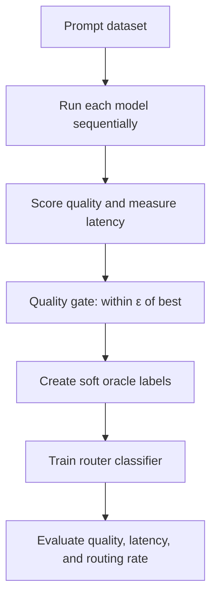

# Open-Weight LLM Router — Project Scope

## Goal

Build a learned router that receives a prompt and selects the **fastest and cheapest open-weight LLM that remains within an acceptable quality margin of the best candidate**. The first version is an offline Colab experiment, not a production service.

## Prototype Constraints and Models

- Free Google Colab GPU with approximately **15 GB VRAM**.
- Run one model at a time, save results, delete it, clear CUDA cache, then load the next.
- Initial candidates:
  1. [Qwen3.5-9B](https://huggingface.co/Qwen/Qwen3.5-9B) — strong autoregressive baseline, loaded in 4-bit.
  2. [Fast-dLLM v2 7B](https://huggingface.co/Efficient-Large-Model/Fast_dLLM_v2_7B) — block-diffusion model.
  3. [LLaDA-8B-Instruct](https://huggingface.co/GSAI-ML/LLaDA-8B-Instruct) — full-diffusion model.
- Memory fallbacks: Fast-dLLM v2 1.5B and Qwen3.5-2B. If LLaDA cannot fit, keep two AR models plus one working diffusion model.

## Free Inference Plan

- **Qwen:** use [Unsloth](https://docs.unsloth.ai/) 4-bit inference or Hugging Face Transformers with `bitsandbytes`.
- **Fast-dLLM:** use its official Hugging Face custom `generate()` implementation and parameters such as `small_block_size`; do not assume Unsloth compatibility.
- **LLaDA:** use its official `trust_remote_code=True` Transformers implementation. Quantization must be tested because custom diffusion code may not support 4-bit reliably.
- Use free Hugging Face model downloads and Colab compute only. Add a short smoke test for each model before processing the dataset.
- Keep identical prompts, maximum output length, batch size, warm-up policy, and hardware. Measure wall-clock latency around generation with `torch.cuda.synchronize()`.

## Dataset and Stored Data

Use about **6,000 prompts** from GSM8K, MMLU, MBPP, CommonsenseQA, and filtered LMSYS conversations. Use task reference answers where available and an open-weight judge or task-specific metric for open-ended answers. Split by prompt into 4,000 train, 1,000 validation, and 1,000 test examples.

Store one row per prompt-model pair:

```text
prompt_id, prompt, task, model, response, quality,
latency_s, output_tokens, tokens_per_second, peak_vram_gb
```

## Oracle Objective

The oracle creates the training label; it is **not** the deployed router.

For prompt \(x\), run all models and obtain quality \(Q_m\), latency \(L_m\), and compute cost \(C_m\). Normalize latency and cost per task/model pool. First enforce the “no meaningful quality loss” constraint:

$$
\mathcal{E}(x)=\{m:Q_m(x)\ge \max_j Q_j(x)-\epsilon\}
$$

Models outside \(\mathcal{E}\) receive zero target probability. Score eligible models by:

$$
S_m = Q_m-\lambda_l\hat L_m-\lambda_c\hat C_m
$$

On free Colab, monetary cost is identical, so initially set \(\lambda_c=0\) and optimize quality plus latency. Later define compute cost as GPU-seconds or estimated hosted GPU cost.

Convert eligible scores into soft oracle labels:

$$
y_m=\frac{\mathbf{1}[m\in\mathcal{E}]\exp(S_m/\tau)}
{\sum_j\mathbf{1}[j\in\mathcal{E}]\exp(S_j/\tau)}
$$

Train a small text encoder plus three-way classification head to output \(p_\theta(m\mid x)\):

$$
\mathcal{L}_{router}=-\sum_m y_m\log p_\theta(m\mid x)
$$

Lower \(\tau\) makes the target close to a single winner; higher \(\tau\) preserves information when multiple models perform similarly. Tune \(\epsilon,\lambda_l,\tau\) only on validation data.



## Script Deliverables and Success

Create modular scripts/notebooks for model smoke tests, generation and timing, response evaluation, oracle-label construction, router training, and held-out evaluation. Cache every completed response so interrupted Colab sessions can resume.

Report router quality, average latency, speedup versus always using the strongest model, selection rate per model/task, oracle upper bound, and regret versus the oracle. Success means near-best-model quality with lower average latency and meaningful use of both autoregressive and diffusion candidates.

## Out of Scope

Candidate-model fine-tuning, proprietary APIs, joint model/router training, multi-GPU serving, dynamic batching, and production deployment.
