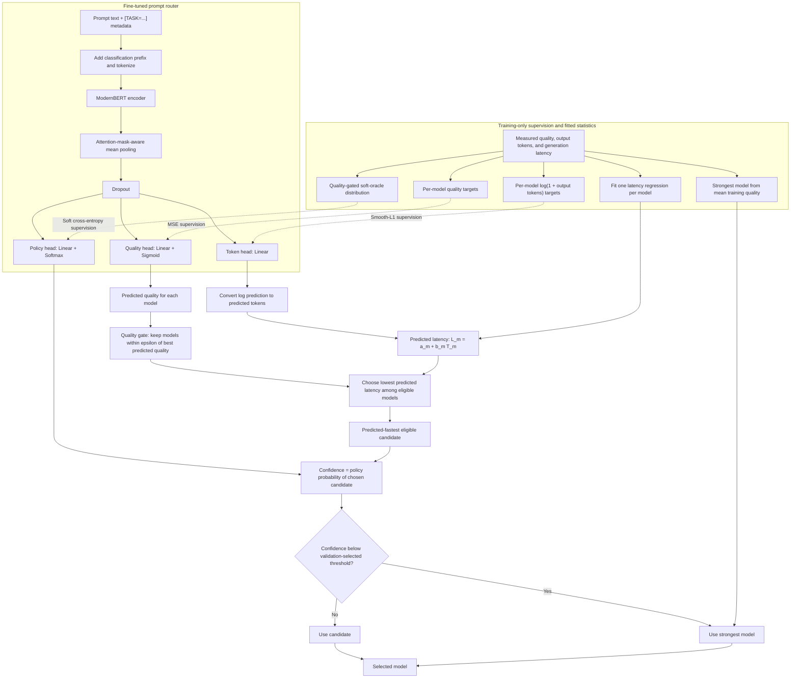

# Latency-Aware Open-Weight LLM Router

## Goal

Build a router that selects the **fastest open-weight LLM predicted to remain within an acceptable quality margin of the best candidate**. This Colab MVP proves latency reduction first; monetary cost can later use the same selector.

## MVP Architecture

- Fine-tune **ModernBERT** on the prompt and optional task metadata.
- Predict quality and output-token count for each candidate model.
- Estimate latency as \(\hat L_m=a_m+b_m\hat T_m\), with coefficients fitted from measurements.
- Route to the strongest model when confidence is below a calibrated threshold.



Solid arrows show the inference path and fitted latency/fallback statistics;
dashed arrows show training supervision. The soft oracle creates a policy
target during training but is not available when routing a new prompt.

## Candidate Models and Colab Inference

Use three models that fit individually in approximately 15 GB VRAM:

1. **Qwen3.5-9B (4-bit)** — strongest autoregressive baseline.
2. **Qwen2.5-1.5B-Instruct** — size-matched autoregressive control for Fast-dLLM.
3. **Fast-dLLM v2 1.5B** — diffusion candidate using the official custom generation implementation.

Use the free, open-source **Unsloth** package for supported Qwen inference:

```python
from unsloth import FastLanguageModel

model, tokenizer = FastLanguageModel.from_pretrained(
    model_name="unsloth/<supported-qwen-4bit-checkpoint>",
    max_seq_length=2048,
    load_in_4bit=True,
)
FastLanguageModel.for_inference(model)
```

Use Fast-dLLM's official inference code because Unsloth support should not be assumed. Load one candidate, warm it up, benchmark all assigned prompts, save results, unload it, and then load the next. **Do not reload a model per prompt**: cold-start time would dominate latency. Report loading time separately from warm generation latency.

## Dataset

Use GSM8K, MMLU, and ARC-Challenge directly for the first real pilot because their references can score newly generated answers deterministically. RouterBench remains useful for validating routers against its existing models, but its released wide table does not contain the reference labels needed to score new candidate responses. Begin with 30 prompts per task in Colab, then increase to at least 100 per task after the full pipeline passes.

Store one row per prompt-model pair:

```text
prompt_id, prompt, task, model, response, quality,
ttft_s, total_latency_s, output_tokens, tokens_per_second
```

Use identical hardware, decoding settings, output limits, batch size, and warm-up policy. Measure generation with `torch.cuda.synchronize()` before and after timing.

## Soft Oracle Objective

The oracle supplies training targets and an upper bound; it is not used during deployment. For each prompt, keep models within \(\epsilon\) of the best observed quality:

$$
\mathcal{E}(x)=\{m:Q_m(x)\ge \max_j Q_j(x)-\epsilon\}
$$

For eligible models, combine quality and normalized latency:

$$
S_m=Q_m-\lambda_l\hat L_m
$$

Convert scores into soft targets:

$$
y_m=
\frac{\mathbf{1}[m\in\mathcal{E}]\exp(S_m/\tau)}
{\sum_j\mathbf{1}[j\in\mathcal{E}]\exp(S_j/\tau)}
$$

Train ModernBERT with soft cross-entropy:

$$
\mathcal{L}_{router}=-\sum_m y_m\log p_\theta(m\mid x)
$$

The quality gate preserves the project's main promise; the soft distribution retains information when multiple models are similarly good. Tune \(\epsilon\), \(\lambda_l\), \(\tau\), and the confidence threshold only on validation data.

## Success Metrics

Report quality retention, mean latency reduction, strongest-model usage reduction, selection rate by model/task, oracle upper bound, and regret versus the oracle. Describe latency as **controlled warm-model inference on one Colab GPU**, not production serving latency.

## Out of Scope

Candidate-model fine-tuning, proprietary APIs, live prices, dynamic per-request model loading, multi-GPU serving, and production deployment.
