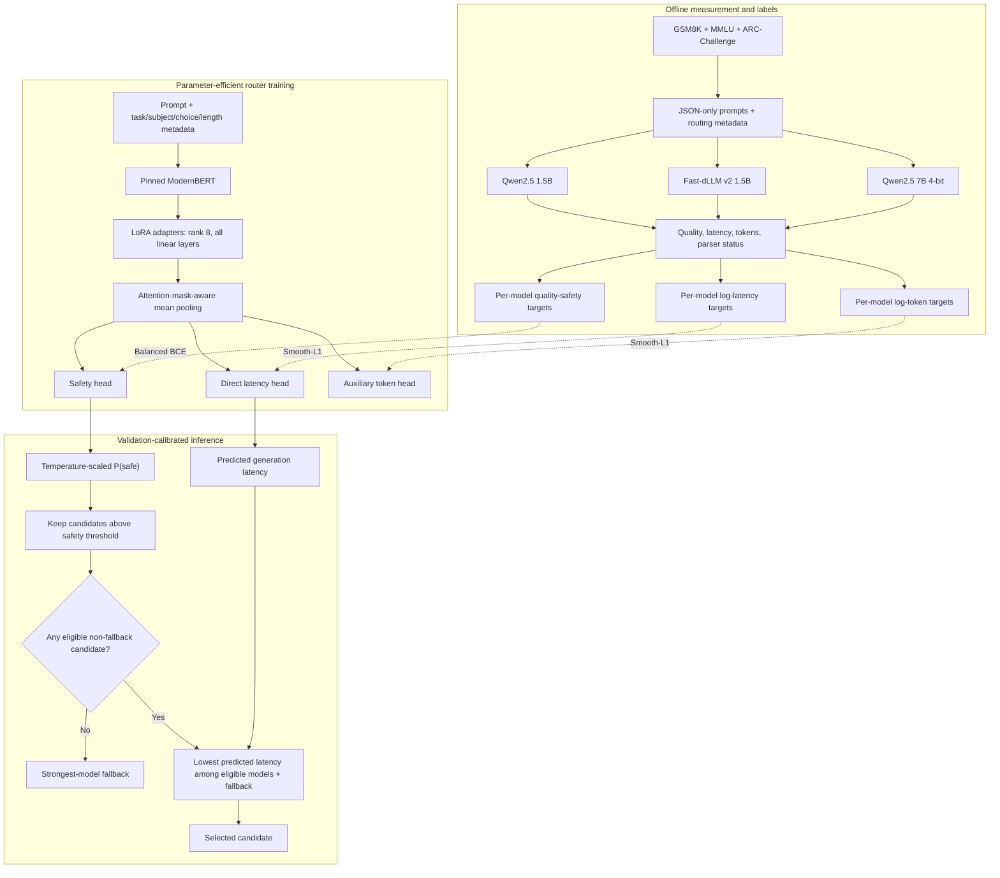

# Quality-Safe Latency-Aware Open-Weight LLM Router

## Goal

Build a prompt-only router that selects the lowest-latency open-weight LLM that
is predicted to remain within an acceptable quality margin of the best
candidate. The v3 Colab MVP improves the decision alignment, data balance,
latency modeling, cache reproducibility, and validation procedure of the v2
experiment. Monetary cost, production serving, and candidate-model fine-tuning
remain out of scope.

The primary experiment asks whether routing can retain at least **98% of the
strongest training-model accuracy** while producing a positive, statistically
credible reduction in warm batch-size-one generation latency after including
router overhead.

## What Changes From v2

1. Replace the soft-oracle policy head with per-model **quality-safety logits**.
2. Predict per-model generation latency directly; keep output-token prediction
   as an auxiliary task.
3. Train and route with the same safety definition and decision rule.
4. Upweight training prompts where a non-fallback model is the oracle winner or
   candidate models disagree.
5. Adapt ModernBERT with **LoRA** instead of fully fine-tuning or completely
   freezing the encoder. Only low-rank adapter weights and the three lightweight
   prediction heads are trained.
6. Add task metadata such as MMLU subject, choice count, and prompt-length bin.
7. Standardize concise, JSON-only answer formats and task-specific output caps
   across candidates.
8. Calibrate safety probabilities and the routing threshold only on validation
   data, and select checkpoints using feasible validation routing performance.
9. Fingerprint cache files with model revisions, prompt format, generation
   parameters, package versions, and hardware configuration.
10. Export the trained router state, tokenizer, calibration parameters, latency
    diagnostics, configuration, and decision reports.

## System Architecture



Solid arrows are the runtime decision path. Dashed arrows are supervision used
only while training the router. Candidate responses and observed quality are
never required when routing a new prompt.

## Candidate Models and Runtime

The v3 notebook preserves the measured v2 candidate pool so improvements can be
compared without changing both the router and candidates simultaneously:

1. `Qwen/Qwen2.5-7B-Instruct` in NF4 4-bit as the strong fallback.
2. `Qwen/Qwen2.5-1.5B-Instruct` as the small autoregressive control.
3. `Efficient-Large-Model/Fast_dLLM_v2_1.5B` using its official custom
   generation implementation.

All candidates run under the Fast-dLLM-compatible Transformers 4.53.1 runtime.
Fast-dLLM uses a pinned repository revision and explicitly sets
`block_size=32`, `small_block_size=8`, and `threshold=0.9`. The notebook resolves
and records the immutable Hugging Face revision for every other model before
building its cache fingerprint.

Load one candidate, run a smoke test and two warm-up prompts, benchmark all
assigned prompts, flush results resumably, and unload it before loading the next
candidate. Loading time is recorded separately and is not included in routing
latency.

## Prompt and Generation Contract

All candidates receive the same system message, chat template intent, greedy or
deterministic architecture-appropriate decoding, batch size, and task-specific
output cap:

```text
gsm8k:        192 new tokens
mmlu:          64 new tokens
arc_challenge: 64 new tokens
```

Every cap is an exact multiple of Fast-dLLM's 32-token block size.

Prompts tell the model to reason internally and return only the requested JSON
object. This reduces latency differences caused purely by unsolicited verbose
explanations. Multiple-choice outputs use `{"answer": "LETTER"}` and GSM8K
uses `{"answer": "number"}`.

## Dataset and Metadata

Use deterministic samples of 300 prompts from each of GSM8K, MMLU, and
ARC-Challenge: **900 prompts and 2,700 candidate generations**. Preserve stable
prompt IDs when extending an existing v3 experiment.

Store prompt metadata:

```text
prompt_id, task, subject, num_choices, prompt_words, length_bin,
prompt, reference
```

Store one measured row per prompt-model pair:

```text
prompt_id, task, model, model_repo, model_revision, response,
generation_s, encode_s, input_tokens, output_tokens, tokens_per_second,
peak_vram_gb, load_time_s, generation_profile, run_fingerprint, status, error
```

True time-to-first-token is not measured because the custom generation APIs do
not expose a comparable streaming callback. `generation_s` is synchronized GPU
wall time covering prefill and generation. Router overhead is measured
separately and added during evaluation.

## Quality Labels

Quality is deterministic exact match after task-aware parsing. Numeric GSM8K
answers are canonicalized so equivalent decimal representations such as `36`
and `36.0` compare equal. Parser success and strict JSON-format compliance are
stored separately from correctness.

For prompt (x), define observed quality safety for candidate (m) as:

$$
z_m(x)=\mathbf{1}\left[Q_m(x)\ge \max_j Q_j(x)-\epsilon_q\right]
$$

The default is \(\epsilon_q=0\) because quality is binary exact match. If all
candidates are wrong, all are equally safe relative to observed best quality;
the fastest one supplies the latency-oriented oracle target for that prompt.

## Router Architecture

The router input is:

```text
[TASK=...] [SUBJECT=...] [CHOICES=...] [LENGTH_BIN=...] prompt
```

An attention-mask-aware mean-pooled ModernBERT representation feeds three
per-model heads:

1. safety logits, trained with class-balanced binary cross-entropy;
2. `log(1 + generation_s)`, trained with Smooth-L1 loss;
3. `log(1 + output_tokens)`, trained with Smooth-L1 auxiliary loss.

The encoder is `nomic-ai/modernbert-embed-base` at a pinned revision. PEFT 0.17.1
wraps it as a feature-extraction model with LoRA applied to every linear layer:

```text
rank r:          8
LoRA alpha:     16
LoRA dropout: 0.05
target modules: all-linear
bias:          none
```

The original ModernBERT weights remain frozen. Gradients update only the LoRA
matrices and the three router heads. This supplies limited task adaptation while
greatly reducing the number of trainable parameters and the risk of overfitting
the 540-prompt training split.

Training sampling gives extra weight to prompts where the latency-minimizing
quality-safe oracle is not the strongest model and to prompts where candidate
quality labels disagree. This counters fallback-label dominance without using
test information.

## Validation Calibration and Routing

Split prompts, stratified by task, into 60% train, 20% validation, and 20% sealed
test. Determine the strongest fallback using training quality only.

For each model, temperature-scale safety logits using validation data. For a
candidate threshold \(c\), define the predicted eligible set:

$$
\widehat{\mathcal E}(x;c)=
\{m:P(z_m=1\mid x)\ge c\}.
$$

The strongest fallback is always available. Select:

$$
\hat m(x)=\arg\min_{m\in\widehat{\mathcal E}(x;c)} \widehat L_m(x).
$$

Choose the checkpoint and threshold using validation data only. A configuration
is feasible when aggregate quality retention is at least 0.98 and latency
reduction after router overhead is positive. Among feasible configurations,
maximize latency reduction, then minimize quality-constraint violations. If no
configuration is feasible, disable the router and deploy the strongest model
without router overhead.

## Evaluation and Success Criteria

Report on the sealed test split:

- accuracy and quality retention;
- mean generation latency and router overhead;
- latency reduction versus the strongest model;
- strongest-model usage and selection rate by task;
- quality-constraint violation rate and regret;
- oracle upper bound;
- paired bootstrap intervals for accuracy difference and latency reduction;
- safety calibration diagnostics;
- direct latency MAE and \(R^2\) per model;
- parser coverage and strict-format compliance.

A positive result requires all of the following:

1. test quality retention is at least 0.98;
2. mean latency reduction is positive and its 95% bootstrap interval does not
   materially support a slowdown;
3. constraint violations remain acceptable;
4. non-fallback selections occur in meaningful, defensible prompt subgroups;
5. at least one faster non-fallback candidate is used often enough to justify
   maintaining it as a worker.

The result must be described as controlled warm-model inference on one Colab
GPU. Production savings require already-loaded candidate workers.

## Synchronized Deliverables

`notebooks/03_quality_safe_colab_router.ipynb` is the executable implementation
of this document. Its configuration cell repeats the same model pool, dataset
size, output caps, safety definition, split, retention target, training mode,
LoRA configuration, and selection rule. The notebook writes a copy of its synchronized experiment
contract into the report directory and asserts its schema version and critical
constants before benchmarking.

## Out of Scope

Candidate-model fine-tuning, proprietary APIs, monetary price optimization,
dynamic per-request model loading, multi-GPU serving, batching, streaming TTFT,
and production deployment.
