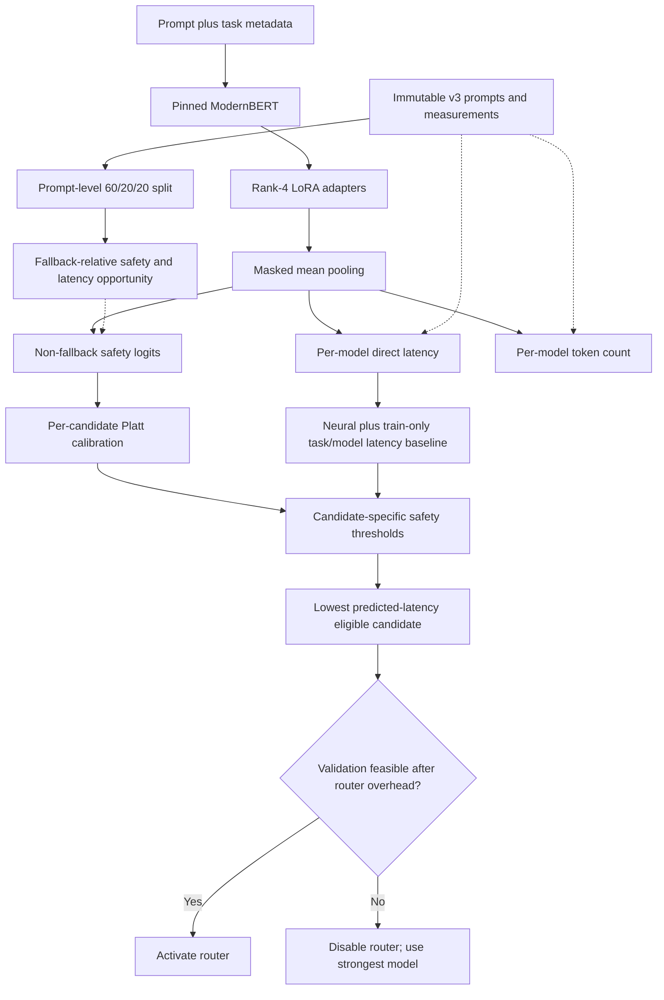

# Decision-Aligned Quality-Preserving LLM Router

## Goal

Build a prompt-only router that reuses the completed v3 candidate measurements
and learns when a faster open-weight model can replace the strongest model
without materially reducing answer quality. The v4 experiment is successful
only when sealed-test accuracy is at least **98% of the strongest training-model
baseline** and warm batch-size-one latency, including router overhead, is lower.

V4 does not regenerate candidate answers. It treats the v3 prompt pool and its
2,700 fingerprinted measurements as an immutable offline decision dataset. This
isolates router improvements from changes in model revisions, prompts, decoding,
hardware, or timing conditions.

## Why v3 Always Deployed the Fallback

V3 behaved safely: no validation threshold simultaneously retained 98% quality
and reduced latency after approximately 53 ms of router overhead, so its final
deployment branch selected the Qwen2.5 7B fallback for every test prompt.

The v4 router addresses four limitations that may have contributed:

1. V3 downweighted positive safety labels when safety prevalence exceeded 50%.
2. Temperature-only calibration could not correct the intercept shift introduced
   by weighted binary cross-entropy.
3. Checkpoints were ranked before final calibration and without online overhead.
4. Safety was defined relative to the best observed candidate rather than the
   actual deployment question: whether a candidate can replace the fallback.

## Reused Offline Evidence

The notebook reads the existing v3 root:

```text
/content/drive/MyDrive/llm_router_v3
```

Required inputs are:

```text
run_manifest_v3.json
data/prompts_v3.parquet
data/measurements_v3.parquet
```

Before training, v4 verifies all of the following:

- v3 schema version is 3;
- prompt template is `v3-json-only-2026-08-07`;
- seed is 42;
- there are 300 prompts from each task and 900 unique prompts total;
- the candidate model names and repositories match the synchronized pool;
- the current GPU type matches the GPU recorded for v3 candidate timings, so
  newly measured router overhead is comparable;
- every measurement row carries the v3 generation fingerprint;
- the panel contains exactly one successful row for every prompt-model pair;
- measured quality, latency, and token targets are finite and valid.

The v3 generation fingerprint remains the identity of the reused evidence. V4
creates a separate router fingerprint and writes only to `reports_v4` and
`artifacts_v4`; it never overwrites candidate caches or v3 router artifacts.

## Candidate Pool and Baseline

The immutable measured candidates are:

1. `qwen2.5-1.5b-ar` — `Qwen/Qwen2.5-1.5B-Instruct`;
2. `fast-dllm-v2-1.5b` — `Efficient-Large-Model/Fast_dLLM_v2_1.5B`;
3. `qwen2.5-7b-4bit` — `Qwen/Qwen2.5-7B-Instruct` in NF4.

Prompts are split 60%/20%/20%, stratified by task, using the same deterministic
seed as v3. The fallback is determined from training accuracy only. The other
two models are replacement candidates; the fallback is always available and
does not need a learned safety probability.

## Fallback-Relative Safety and Opportunity

For prompt \(x\), fallback \(f\), and non-fallback candidate \(m\), define:

$$
y_m(x)=\mathbf{1}\left[Q_m(x)\ge Q_f(x)-\epsilon_q\right].
$$

The default is \(\epsilon_q=0\) because quality is binary exact match. This
target directly answers whether replacing the deployed fallback loses observed
quality. If both models are wrong, the replacement is safe relative to the
baseline even when a third candidate is correct.

A safe replacement is useful only when it is faster. Its normalized measured
opportunity is:

$$
g_m(x)=y_m(x)\max\left(0,\frac{L_f(x)-L_m(x)}{L_f(x)}\right).
$$

Unsafe replacements receive a quality-cost indicator:

$$
d_m(x)=\max(0,Q_f(x)-Q_m(x)).
$$

These values affect training weights only on the training split.

## Router Input and Architecture

The input format remains:

```text
[TASK=...] [SUBJECT=...] [CHOICES=...] [LENGTH_BIN=...] prompt
```

The encoder is the pinned `nomic-ai/modernbert-embed-base` revision used by v3.
Its base weights remain frozen. PEFT inserts rank-4 LoRA adapters with alpha 8,
dropout 0.05, and `target_modules="all-linear"`, reducing trainable encoder
capacity relative to v3's rank 8. Maximum router input length is 512 tokens to
reduce batch-one inference overhead.

Attention-mask-aware mean pooling feeds three heads:

1. **Replacement-safety head:** one logit for each non-fallback candidate;
2. **Direct-latency head:** log latency for every candidate;
3. **Output-token head:** auxiliary log token count for every candidate.



## Training Objective

The base safety loss is unweighted binary cross-entropy. V4 does not use the v3
prevalence formula that could assign positive labels a weight below one.

Each safety example then receives a decision-aware multiplier:

```text
safe replacement:   1 + 2.0 * normalized latency opportunity
unsafe replacement: 1 + 4.0 * observed quality drop
```

This penalizes missed safe speedups without blindly penalizing fallback use.
Unsafe switches remain more expensive because they threaten the quality
constraint. The full loss is:

$$
\mathcal L =
1.0\mathcal L_{safety}+
0.75\mathcal L_{latency}+
0.10\mathcal L_{tokens}+
0.25\mathcal L_{opportunity-margin}.
$$

The opportunity-margin term encourages the safety logit of a safe, faster
replacement to exceed a positive margin in proportion to its latency gain. It
does not reward selecting a slower candidate. Uniform shuffled batches replace
weighted sampling so the empirical prompt distribution remains intact.

## Latency Prediction

V3's direct latency head generalized poorly for the two Qwen candidates. V4
therefore combines two validation-safe predictors:

- the neural direct-latency prediction;
- a training-only median latency for each task/model pair.

For blend coefficient \(\alpha\):

$$
\widehat L_m(x;\alpha)=
\alpha\widehat L^{neural}_m(x)+(1-\alpha)\widetilde L^{train}_{task(x),m}.
$$

Validation searches `0.0, 0.25, 0.5, 0.75, 1.0`. This allows the experiment to
fall back to a stable empirical predictor when the neural head adds noise.

## Calibration and Selection

For each non-fallback candidate, validation fits Platt scaling:

$$
P_m(safe\mid x)=\sigma(a_m s_m(x)+b_m),
$$

where \(s_m\) is the raw safety logit. Unlike temperature scaling, both slope
and intercept are learned. Five-fold out-of-fold Platt predictions are used
while comparing checkpoints and selector settings; the final test calibrator is
fit once on all validation examples after the best checkpoint is restored.

V4 searches a separate threshold for each non-fallback candidate over:

```text
0.50, 0.60, 0.70, 0.75, 0.80, 0.85, 0.90, 0.95, 0.975
```

A replacement is eligible when:

1. its calibrated safety probability meets its own threshold; and
2. its predicted latency is at least 2% lower than predicted fallback latency.

The fallback is always eligible. Among eligible models, select the lowest
predicted latency. `selected_fallback` means the chosen model is the fallback;
`no_eligible_alternative` is reported separately.

## Decision-Aligned Checkpoint Selection

After every epoch, the notebook performs the same steps used by the final
selector:

1. run validation inference at batch size one and measure router overhead;
2. obtain out-of-fold Platt-calibrated safety probabilities;
3. search candidate-specific thresholds and latency blend coefficients;
4. add measured per-prompt router overhead to selected generation latency;
5. reject settings below 98% quality retention or without positive net savings;
6. among feasible settings, maximize latency reduction, then minimize observed
   quality-loss rate, then prefer higher thresholds.

Any feasible checkpoint outranks every infeasible checkpoint. If none is
feasible, the lowest validation loss is retained for diagnosis but the deployed
router is disabled.

## Sealed Evaluation

After checkpoint, calibration, thresholds, and latency blend are frozen, report
on the untouched test split:

- accuracy, quality retention, and accuracy difference from fallback;
- generation latency, router overhead, and net latency reduction;
- selected-model and eligible-model rates by task;
- fallback-relative quality-loss rate and quality regret;
- strongest, always-fastest, outcome-aware oracle, and router strategies;
- paired bootstrap intervals for accuracy difference and latency reduction;
- per-candidate Brier scores and reliability summaries;
- latency and token MAE and \(R^2\);
- the number and latency value of missed safe opportunities.

The outcome-aware oracle chooses the fastest candidate that is no worse than
the fallback on each prompt. It is an unattainable upper bound and uses test
outcomes only for retrospective comparison.

## Deployment Guard

Activate the router only if the selected validation configuration has:

```text
quality retention >= 0.98
net latency reduction > 0
```

Otherwise deploy the strongest model directly with zero router overhead. A
disabled router is a valid negative experimental result, not a training error.

## Reproducibility and Exports

The v4 router fingerprint contains the full router contract: evidence
fingerprint, split seed, encoder revision, LoRA settings, optimizer settings,
loss weights, input length, calibration method and folds, threshold grid,
latency blend grid, minimum predicted speedup, and deployment constraints.

Export:

```text
reports_v4/synchronized_contract_v4.json
reports_v4/training_history_v4.csv
reports_v4/selector_search_v4.csv
reports_v4/evaluation_v4.csv
reports_v4/test_decisions_v4.parquet
reports_v4/calibration_diagnostics_v4.csv
reports_v4/latency_diagnostics_v4.csv
artifacts_v4/<evidence-tag>__<router-tag>/
```

The artifact directory contains the LoRA adapter, router heads, tokenizer,
Platt coefficients, thresholds, latency blend, training-only latency baselines,
and a manifest sufficient to reconstruct inference.

## Synchronized Deliverable

`notebooks/04_decision_aligned_quality_router.ipynb` is the executable
implementation of this document. Its contract cell repeats and asserts the
schema version, v3 evidence requirements, model pool, split, fallback-relative
safety definition, rank-4 LoRA configuration, loss weights, Platt calibration,
threshold grid, latency blend grid, 2% predicted-speedup gate, 98% retention
target, overhead-inclusive checkpoint rule, and fail-closed deployment guard.

## Out of Scope

Candidate regeneration, candidate-model fine-tuning, proprietary APIs,
monetary-price optimization, dynamic model loading, multi-GPU serving,
streaming TTFT, batching, and production deployment remain out of scope.
